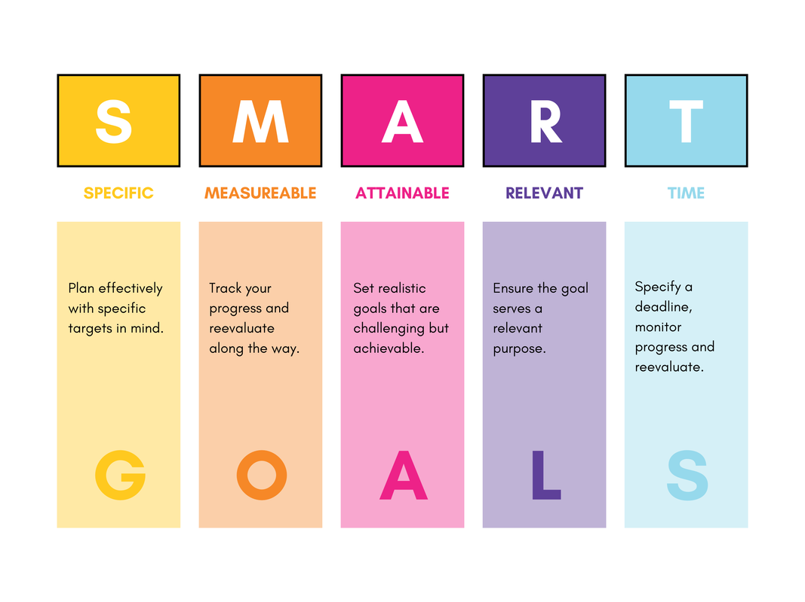

<div class="grid cards" markdown>

-   :material-contacts-outline:{ .lg .middle } [__Luke Richardson__](https://www.linkedin.com/in/luke-richardson/) is currently employed as Network Architect in London.  

    ---

    <iframe src="https://www.google.com/maps/embed?pb=!1m18!1m12!1m3!1d2483.9474921642217!2d-0.13534059999999998!3d51.519386399999996!2m3!1f0!2f0!3f0!3m2!1i1024!2i768!4f13.1!3m3!1m2!1s0x48761b25e0f0f0dd%3A0xffc06a936b93fee5!2sLukeOS%20Labs%20Ltd!5e0!3m2!1sen!2s!4v1624557160453!5m2!1sen!2s" width="100%" height="100%" style="border:0;" allowfullscreen="" loading="lazy"></iframe>

    ---

    - [x] Passionate about all things Network Automation.
    - [x] Determined to deliver robust and scalable Infrastructure as Code.
    - [x] Adept at working with cross-functional teams to deliver complex projects.

    ---

    { width=195px align=right } 
    :material-lan: Network Architect  
    :material-email-outline: [Hello@Lukeoson.com](mailto:Luke.richardson@lloret.co.uk)      
    :material-linkedin: [Linkedin](https://www.linkedin.com/in/luke-richardson/)   
    :material-cellphone: [+447376209455](tel:+447376209455)    
    :material-github: [lukeoson](https://github.com/lukeoson)   
    :material-certificate-outline: [Acclaim](https://www.credly.com/users/luke-richardson.dca3c027)  
    :material-calendar: Please don't hesitate to book time with my [Calendly](https://calendly.com/meet-luke-richardson). 

    ---

</div>

<!-- Calendly badge widget begin -->
<link href="https://assets.calendly.com/assets/external/widget.css" rel="stylesheet">
<script src="https://assets.calendly.com/assets/external/widget.js" type="text/javascript" async></script>
<script type="text/javascript">window.onload = function() { Calendly.initBadgeWidget({ url: 'https://calendly.com/lukeos', text: 'Schedule time with Luke', color: '#0069ff', textColor: '#ffffff', branding: true }); }</script>
<!-- Calendly badge widget end -->

## Employment History 

<div class="grid cards" markdown>

- :material-history:{ .lg .middle } [__Luke's Employment__](https://www.credly.com/users/luke-richardson.dca3c027) in the Technology Industry includes WeWork & Dimension Data.  

    ---

    ```mermaid
    gantt
    dateFormat  YYYY
    title Luke's Career Path

    section Dimension Data
    Project Management & Network Engineer :done, 2012, 2017

    section Redstone
    Network Engineer :done, 2017, 2018

    section Sabbatical
    Peace & Quiet :done, 2018, 2019

    section WeWork
    Network Architect - Global :done, 2019, 2023

    section Lloret Control Systems
    Network Architect :active, 2023, 2025
    ```

    | Where| When | What| Why
    | :-- | :-- | :-- | :-- |
    | Available for Hire | 2024 - :material-infinity: | Network Automation | Bring it all together
    | [Lloret](https://www.lloret.co.uk/) | 2023 - Present | Network Architect | Rediscover my Roots
    | [WeWork](https://www.wework.com/) | 2019 - 2023 | Network Architect - Global | Build Complex Systems at Scale
    | [Redstone](https://www.onnecgroup.com/) | 2017 - 2018 | Network Engineer & TPM | Prove Myself
    | [Dimension Data](https://www.dimensiondata.com/en-gb/) | 2012 - 2017 | PM to Network Engineer | Learn the Ropes

    ---

</div>

## Education

<div class="grid cards" markdown>

- :fontawesome-solid-user-graduate:{ .lg .middle } [__Luke's Education__](https://www.credly.com/users/luke-richardson.dca3c027) includes a BA in Politics prior to his various Tech Industry roles.  

    ---

    | Where | When | What | Why |
    | :--- | :--- | :--- | :--- |
    | [YouTube](https://www.youtube.com/channel/UCRIOI_3REG9zIDM0Fp9Xiyg) | 2008 - 2023 | > 10,000 hours | Life long learner
    | [University of London](https://www.qmul.ac.uk/) | 2005 - 2008 | Politics BA - 2:1 | I should have known better 
    | [Bishop Stopford](https://www.bishopstopford.com/) | 1997 - 2005 | x4 A-levels Grade A | The year they let you retake exams!

    ---

    This chart shows a timeline of Luke's Professional Certifications and upcoming expiry.

    ```mermaid
    gantt
    dateFormat  YYYY
    title Luke's Learning Path 

    section You Tube 
    Stay Curious :active, 2019, 2025

    section CCNA 
    Cisco Route & Switch :done, 2019, 2022
    
    section JNCIA-Junos 
    Juniper Networks Certified Associate - Junos :active, 2020, 2025

    section JNCIA-DevOps 
    Juniper Networks Certified Associate - DevOps :active, 2020, 2025

    section JNCIA-Secuirty 
    Juniper Networks Certified Associate - Security :active, 2020, 2025

    section JNCIA-Mist 
    Juniper Networks Certified Associate - Mist :active, 2020, 2025

    section Juniper Associate x 4 
    Juniper JNCIA x 4 :active, 2021, 2025 

    section JNCIS-DevOps 
    Juniper Networks Certified Specialist - DevOps :active, 2021, 2025 

    section JNCIS-ENT 
    Juniper Networks Certified Specialist - ENT :active, 2023, 2025 

    section JNCIS-Mist 
    Juniper Networks Certified Specialist - Mist :active, 2023, 2025 

    section Juniper Specialist x3 
    Juniper JNCIS x 3 :active, 2023, 2025 

    section Juniper Innovator
    Juniper Networks Innovator :done, 2023, 2024  

    section GitLab Associate 
    GitLab Certified Git Associate :active, 2021, 2025 

    section AWS Certified Cloud
    AWS Certified Cloud :active, 2021, 2025 

    section Okta Professional 
    Okta Certified Professional :done, 2021, 2024 

    section GitHub
    GitHub Foundations :active, 2023, 2025

    section Allied Telesis 
    Allied Telesis Professional ENT :active, 2023, 2025

    section Lost to Time
    Multiple others not stored in Credly :done, 2020, 2025
    ```

    - :material-certificate-outline: [Verify via Credly](https://www.credly.com/users/luke-richardson.dca3c027) and check [Luke's Blog](../blog/index.md) for current learning objectives.

</div>

## Carreer Achievements

<div class="grid cards" markdown>

- :material-star-shooting:{ .lg .middle } [__Luke's Career__](https://www.credly.com/users/luke-richardson.dca3c027) story is of accending rigour & complexity (1) [Smartly Summarised](https://en.wikipedia.org/wiki/SMART_criteria)
{ .annotate}

    1. 

    ---
    __Lloret Control Systems__

    - [x] Greenfield Architecture of Cisco, Meraki, Aruba, & Allied Telesis. 

        :material-arrow-right:_At Lloret, i'm regretfully unfulfilled with the industry segment. I'm looking for something more inspiring that embraces the paradigm shift toward Infrastructure as Code._  
    
        >:material-alpha-s-box: Network Design mapping Client Specifications to constraints.   
        >:material-alpha-m-box: Requirements delivered in strict adherence to defined budget.    
        >:material-alpha-a-box: Managed multitudinous stakeholders expectations.   
        >:material-alpha-r-box: Built a frame of reference for future project pipelines.      
        >:material-alpha-t-box: Delivered in strict adherence to defined timeline.  

    ---
    __WeWork__

    - [x] Key contributor to the global Network Architecture.

        :material-arrow-right:_Circa 750 Branches spanning >100 Countries with x4 Data Centres in x3 Continents._

        >:material-alpha-s-box: Transition the Global Branch Network to Juniper Full Stack.   
        >:material-alpha-m-box: Radically reduced outages & increased network performance.   
        >:material-alpha-a-box: Accommodations for budget & logistics constraints.  
        >:material-alpha-r-box: Enabled the Golden Config for global standardisation.  
        >:material-alpha-t-box: Completed refresh of First Generation Branches by 2023.

    - [x] Key contributor to the global Network Automation & Orchestration Strategy.

        :material-arrow-right:_Much nuance here, lessons learnt and all that jazz._

        >:material-alpha-s-box: Incorporate the Branch Network into a code pipeline.   
        >:material-alpha-m-box: Reduce the time to deploy a change from days to minutes.      
        >:material-alpha-a-box: Built block by block. Source of Truth & Assurance first.   
        >:material-alpha-r-box: Radically reduce team toil & increased Member MPS.   
        >:material-alpha-t-box: Complete the transition to Infrastructure as Code by 2023.   

    - [x] Owner & Keeper of Nautobot & Netbox Sources of Truth & IPFabric Network Assurance.

        :material-arrow-right:_[Network to Code](https://networktocode.com) & [IPFabric](https://ipfabric.com) are wonderful companies - I joyfully advocate for!_ 

        >:material-alpha-s-box: Built Nautobot in AWS & IPFabric as distributed On-Premise.     
        >:material-alpha-m-box: Accurate Database of >10,000 network devices. No Diff.        
        >:material-alpha-a-box: Cross Functional collaboration with DevOps & Security.  
        >:material-alpha-r-box: Ensure we have viable Sources of Truth both actual & desired.    
        >:material-alpha-t-box: Complete the transition to Infrastructure as Code by 2023.  

    - [x] Administrative duties of Splunk Cloud Observability & Okta SSO.

        :material-arrow-right:_An unexpected void following Layoffs - I was eager to help!_ 

        >:material-alpha-s-box: Be the gateway for SSO configuration & access in Network Systems.  
        >:material-alpha-m-box: Configuration & Access verified by Cyber Compliance Team.      
        >:material-alpha-a-box: Training & Documentation for Okta & Splunk.  
        >:material-alpha-r-box: Ensured the Network Team had the correct access to the correct systems.    
        >:material-alpha-t-box: Completed the transition to SSO Okta for capable Systems by 2023.

</div>

## Hobbies

<div class="grid cards" markdown>

- :material-dna:{ .lg .middle } [__Luke's Hobbies__](https://www.credly.com/users/luke-richardson.dca3c027) occupied much of his twenties as he pursued adventure sports. 

    :material-arrow-right:_Alas, time flies, he is now 38 years old and primarily focused on his career._

    ---

    - [x] Rock Climbing. [North Wales Trad](https://www.ukclimbing.com/logbook/set.php?id=165). 
    - [x] Mountaineering. Northern India & Nepal. 

    ---

    Luke's life tree looks like this:

    ```zsh
    ➜  Interests tree
    .
    ├── Adventure
    │   ├── Mountains
    │   └── Rock Climbing
    ├── Politics
    │   ├── Influential-People
    │   └── Power-Structures 
    └── Technology
        ├── Infrastructure as Code
        └── Network Engineering
    ```

</div>

## Testimonials

<div class="grid cards" markdown>

- :material-scale-balance:{ .lg .middle } [__Luke's 2022 WeWork Performance Review__]() 

    :material-arrow-right:_If you would like a reference, [Brandon Ross](https://www.linkedin.com/in/brandon-ross-a00154/) would be a useful starting point.:material-heart:{ .heart }_

    ---

    ***Describe how Luke has successfully delivered business impact:***

    > "Luke is exceptionally good at identifying technology business opportunities and delivering on them. Luke's   management of IPFabric and Netbox have been stellar."   
    
    :material-signature-freehand: _Brandon Ross, Network Architecture Director, WeWork_

    ---

    ***Describe how Luke could work to further elevate their business impact:***

    > "Luke should continue his excellent progress at building relationships with other stakeholders around Wework."   
    
    :material-signature-freehand: _Brandon Ross, Network Architecture Director, WeWork_

    ---

    ***Categorize Luke's proficiency across each impact driver:***

    - [x] *Luke Takes Actions & Delivers `>>>>>>>>>>>>>>`* :material-battery-charging-90: **Core Strength**
    - [x] *Luke Adapts Seamlessly `>>>>>>>>>>>>>>>>>>`* :material-battery-charging-90: **Core Strength**
    - [x] *Luke Thinks Critically `>>>>>>>>>>>>>>>>>>>>>>>>>>`* :material-battery-charging-100: **Exceptional Skill**
    - [x] *Luke Communicates Effectively `>>>>>>>>>>>>>`* :material-battery-charging-90: **Core Strength**
    - [x] *Luke Builds Relationships `>>>>>>>>>>>>>>>>>>`* :material-battery-charging-90: **Core Strength**
    - [x] *Luke's Subject Matter Expertise `>>>>>>>>>>>>>>>>>`* :material-battery-charging-100: **Exceptional Skill**
    - [x] *Rate Luke's business impact `>>>>>>>>>>>>>>>>>>>>>>>>>>>>>>>>>`* :material-battery-charging-90: **High**
    - [x] *Rate Luke's cultural impact `>>>>>>>>>>>>>>>>>>>>>>>>>>>>>>>>>>>`* :material-battery-charging-100: **Maximum**

</div>

---

> Thanks for taking the time to read my resume. [Please get in touch](mailto:hello@lukeoson.com). 🎉
