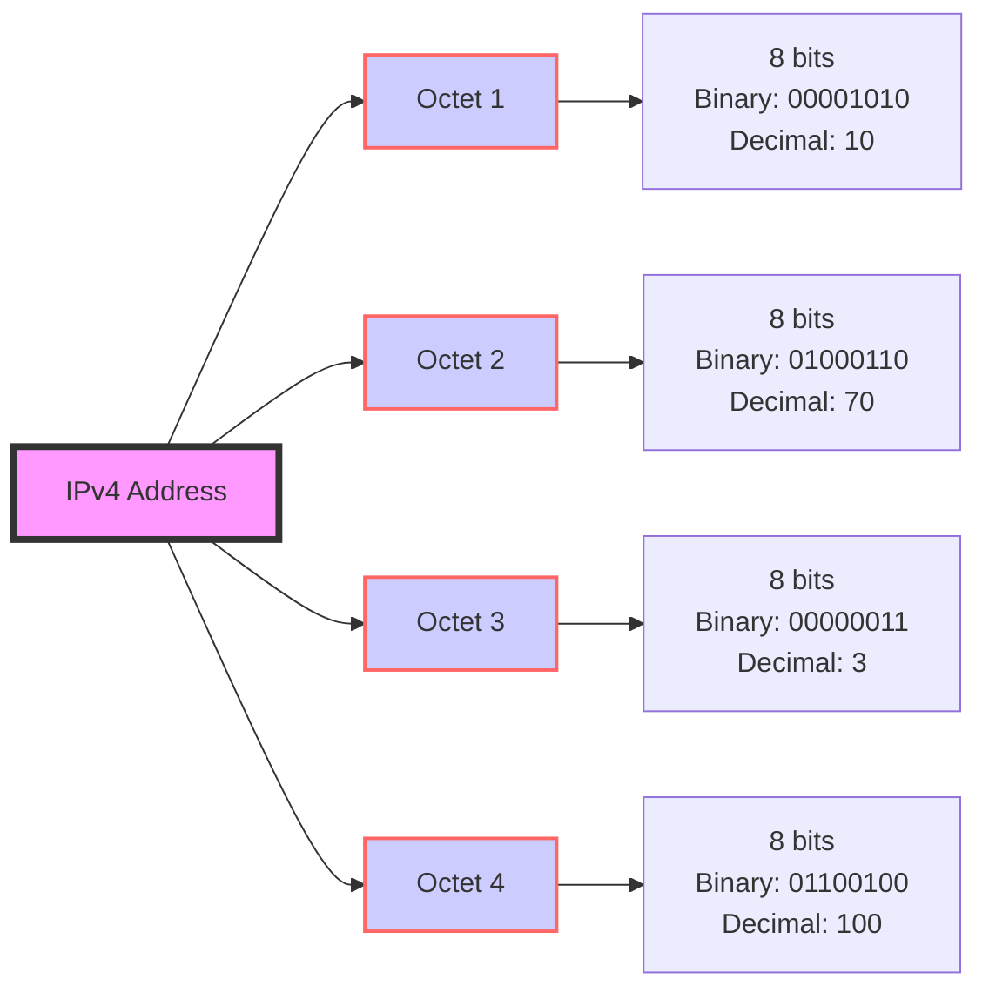

- [x] 32 binary bits - 4 octets - 8 bits per octet.

| Octet Number | Binary Format   | Decimal Equivalent |
|--------------|-----------------|--------------------|
| 1st Octet    | 00000000        | 0 - 255            |
| 2nd Octet    | 00000000        | 0 - 255            |
| 3rd Octet    | 00000000        | 0 - 255            |
| 4th Octet    | 00000000        | 0 - 255            |

| Octet Number | Binary Format   | Decimal Equivalent |
|--------------|-----------------|--------------------|
| 1st Octet    | 11000000        | 192                |
| 2nd Octet    | 10101000        | 168                |
| 3rd Octet    | 00000001        | 1                  |
| 4th Octet    | 00000010        | 2                  |

| Octet Number | Binary Format   | Decimal Equivalent |
|--------------|-----------------|--------------------|
| 1st Octet    | 00001010        | 10                 |
| 2nd Octet    | 01000110        | 70                 |
| 3rd Octet    | 00000011        | 3                  |
| 4th Octet    | 01100100        | 100                |
