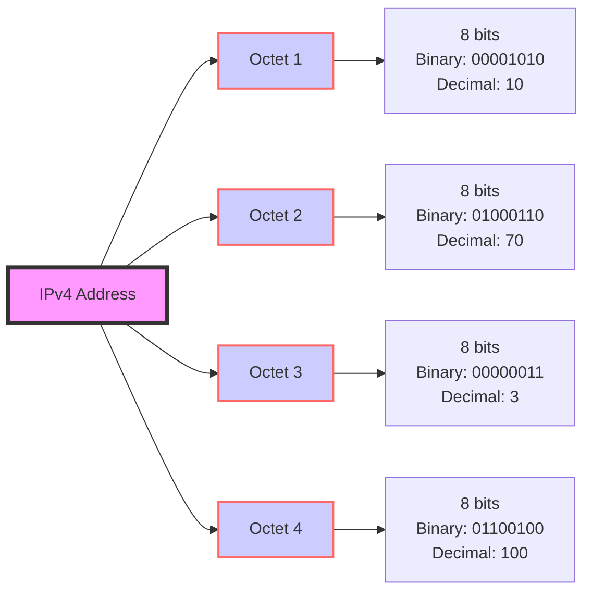

- [x] 32 binary bits - 4 octets - 8 bits per octet.
- [x] Computers only read bits. They just see 32 bits. 
- [X] IPv4 addresses are assigned by IANA (Internet Assigned Numbers Authority).
    - They allocate routable IP addresses to ISPs (Internet Service Providers).
    - ISPs assign routable IP addresses to customers.

---

- [x] [Wireshark](https://www.wireshark.org/tools/oui-lookup.html) Packet Capture to show public and private addresses. 

---

| Octet Number | Binary Format   | Decimal Equivalent |
|--------------|-----------------|--------------------|
| 1st Octet    | 00000000        | 0 - 255            |
| 2nd Octet    | 00000000        | 0 - 255            |
| 3rd Octet    | 00000000        | 0 - 255            |
| 4th Octet    | 00000000        | 0 - 255            |

| Octet Number | Binary Format   | Decimal Equivalent |
|--------------|-----------------|--------------------|
| 1st Octet    | 11000000        | 192                |
| 2nd Octet    | 10101000        | 168                |
| 3rd Octet    | 00000001        | 1                  |
| 4th Octet    | 00000010        | 2                  |

| Octet Number | Binary Format   | Decimal Equivalent |
|--------------|-----------------|--------------------|
| 1st Octet    | 00001010        | 10                 |
| 2nd Octet    | 01000110        | 70                 |
| 3rd Octet    | 00000011        | 3                  |
| 4th Octet    | 01100100        | 100                |

| Aspect                  | Wildcard Mask                          | Subnet Mask                          |
|-------------------------|---------------------------------------|-------------------------------------|
| Purpose                 | Used in Access Control Lists (ACLs) to specify which IP addresses to permit or deny access to. | Used in IP addressing to divide a network into subnetworks and determine the network and host portions of an IP address. |
| Format                  | Inverse of subnet mask. It marks the bits that are to be matched with the corresponding bits in an IP address. | Binary mask with 1s indicating the network portion and 0s indicating the host portion. |
| Representation          | Typically represented with the "wildcard bits" keyword in ACLs, followed by a series of four octets with values between 0 and 255 separated by dots. Example: `0.0.0.255` | Represented using the same dotted decimal format as IP addresses, with a varying number of bits set to 1. Example: `255.255.255.0` |
| Usage Example           | To permit access to IP addresses within a specific range, specify the wildcard mask in an ACL entry. Example: `permit 192.168.1.0 0.0.0.255` allows all addresses in the `192.168.1.0/24` subnet. | To define network boundaries within an IP address range, apply the subnet mask to the IP addresses. Example: `192.168.1.0/24` represents a subnet with a subnet mask of `255.255.255.0`. |
| Network Calculation     | To calculate the network ID from an IP address, perform a bitwise AND operation with the IP address and the wildcard mask. | To calculate the network ID from an IP address, perform a bitwise AND operation with the IP address and the subnet mask. |
