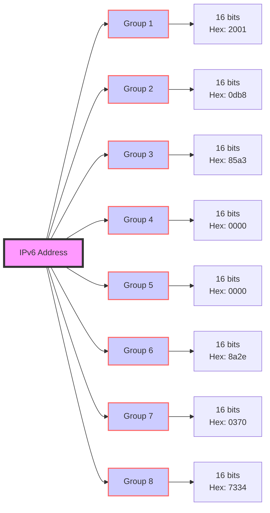

[Google IPv6 Adoption Tracker](https://www.google.com/intl/en/ipv6/statistics.html#tab=ipv6-adoption)

---

- [x] 128 binary bits - 8 groups (hextets) - 16 bits per group.

| Group Number | Binary Format           | Hexadecimal Equivalent |
|--------------|-------------------------|------------------------|
| 1st Group    | 0000000000000000        | 0000 - FFFF            |
| 2nd Group    | 0000000000000000        | 0000 - FFFF            |
| 3rd Group    | 0000000000000000        | 0000 - FFFF            |
| 4th Group    | 0000000000000000        | 0000 - FFFF            |
| 5th Group    | 0000000000000000        | 0000 - FFFF            |
| 6th Group    | 0000000000000000        | 0000 - FFFF            |
| 7th Group    | 0000000000000000        | 0000 - FFFF            |
| 8th Group    | 0000000000000000        | 0000 - FFFF            |

Example IPv6 Address: `2001:0db8:85a3:0000:0000:8a2e:0370:7334`

| Step | Description                                      | IPv6 Address                           |
|------|--------------------------------------------------|----------------------------------------|
| 1    | Remove leading zeros in each block               | `2001:db8:85a3:0:0:8a2e:370:7334`        |
| 2    | Collapse consecutive blocks of zeros with `::`   | `2001:db8:85a3::8a2e:370:7334`            |

- The IPv6 address `2001:db8:85a3::8a2e:370:7334` must remain as it is. 
- The rules for shortening an IPv6 address allow for the removal of leading zeros within each 16-bit block. 
- Replacement of consecutive blocks of all zeros with ``::`` 
- They do not permit the removal of entire non-zero blocks.

!!! note
    Dropping leading zeros in IPv6 addresses still makes sense because each field in an IPv6 address is understood to be a fixed size of 16 bits, represented in hexadecimal. When you see a field like 0db8, it's clear that it represents four hexadecimal digits, even if it's written as db8. The leading zero doesn't add any additional information because the size of the field is already established.

