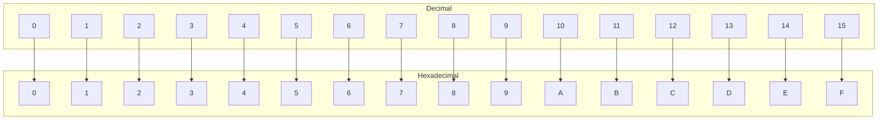

### What is Hexadecimal?

- [x] MAC Addresses are 48 bits long.

- [x] IPv6 Addresses are 128 bits long.

- [x] Made of 16 Symbols

- [x] More User-Friendly Than Binary

- [x] Base-16 Numbering System: Hexadecimal is a base-16 system. Power of 16.

- [x] Binary is Base-2: Binary is a base-2 system. Power of 2.

- [x] Decimal is Base-10: Power of 10. 10 Digits! Caveman Counting. 

### Convert Binary to Hexadecimal

- [x] Nibbles: 4 bits = 1 nibble

| Decimal | Hexadecimal | Binary     |
|---------|-------------|------------|
| 0       | 0           | 0000       |
| 1       | 1           | 0001       |
| 2       | 2           | 0010       |
| 3       | 3           | 0011       |
| 4       | 4           | 0100       |
| 5       | 5           | 0101       |
| 6       | 6           | 0110       |
| 7       | 7           | 0111       |
| 8       | 8           | 1000       |
| 9       | 9           | 1001       |
| 10      | A           | 1010       |
| 11      | B           | 1011       |
| 12      | C           | 1100       |
| 13      | D           | 1101       |
| 14      | E           | 1110       |
| 15      | F           | 1111       |

