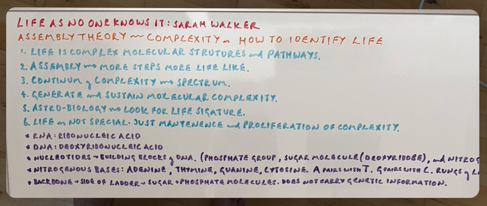

# Life As No One Knows It: The Physics of Life's Emergence

## Author: Sara Imari Walker

??? tip "Listen to Luke read this Post"
    Click the play button below to listen to the audio version of this post.

    <audio controls>
      <source src="/assets/audio/Book-Review-Life-As-No-One-Knows-It.m4a" type="audio/mp4">
      Your browser sucks and does not support the audio element.
    </audio>

## Gist

> Assembly Theory. Life is complex molecular structures and pathways.

## Summary 

**Life as No One Knows It: Assembly Theory and the Search for Life’s Origins** introduces a fresh perspective on life by focusing on the complexity of molecular assembly. By rethinking life as a continuum of assembly complexity rather than a strict category, Walker and Cronin challenge existing paradigms and open new avenues for understanding life’s origins and detecting it in the universe. While their approach leans heavily towards complexity and speculative thinking, it provides a thought-provoking framework that could reshape the scientific and philosophical discourse on what it means to be alive.

<!-- more -->

## Terms & Concepts

!!! info "Helpful Context & Definitions"
    - RNA: Ribonucleic Acid
    - DNA: Deoxyribonucleic Acid
    - Nucleotides - Building blocks of DNA
        - Phosphate group
        - Sugar molecule (deoxyribose) 
        - Nitrogenous base 
    - Nitrogenous bases - **Adenine, Thymine, Guanine, Cytosine** - (rungs of ladder in helix)
        - A pairs with T & G pairs with C
    - Backbone - sugar and phosphate molecules - (side of ladder in helix) 
        - Does not carry genetic information
    - Assembly Theory: Complexity - How to identify Life!

## Ideas 

1. **Assembly:** More steps means more life like. How to detect life by looking for complexity. 
2. **Life as a continuum of complexity:** No binary life or no life. It is a spectrum. Life as the ability to generate and sustain complexity.
3. **Origin of life and evolution:** Simple to complex chemistry. A system reaches a threshold of complexity -> then biological evolution can commence. Molecules to Organisms. 
4. **Astro-Biology:** How to find life in the universe? Molecular complexity as the signature of life. Look for it!
5. **Life purpose and meaning:** Just the maintenance and proliferation of complexity. We / Life is not special. No specific set of characteristics beyond molecular complexity. 

## Thoughts

1. **Bias toward complexity and novelty:** The authors are clearly biased towards viewing complexity as a primary criterion for defining and understanding life. This bias may lead them to undervalue simpler forms of life or the role of simplicity in biological systems. However, this emphasis on complexity helps bridge gaps in understanding between chemistry, biology, and physics.
2. **Challenge to traditional definitions:** Walker and Cronin’s work challenges conventional definitions of life, which could be seen as biased against traditional biological frameworks. They advocate for a broader and more inclusive understanding of life, which could change how life is recognised and studied.
3. **Emphasis on interdisciplinary approaches:** The book’s bias towards interdisciplinary suggests that solutions to understanding life’s complexity and origins lie at the intersection of different scientific fields. This may downplay the contributions of specialised studies in favour of a more integrative approach.
4. **Speculative nature:** Given its theoretical framework, the book leans towards speculative ideas about life’s nature and the detection of extraterrestrial life. This speculative bias may invite criticism for lack of empirical support but is also where its innovative strength lies, pushing the boundaries of current scientific thought.
5. **Philosophical and ethical overtones:** Walker and Cronin’s work is not just a scientific proposal but also philosophical. Their bias towards redefining life has ethical implications, such as how humanity interacts with potential extraterrestrial life forms and the moral consideration of recognising different forms of life.

## Concluding Remark 

I can't decide if this is a theory of the intuitively obvious or a profound new imagining of... everything ever. 

## Whiteboard

## Quotes

> What modern science has taught us is that life is not a property of matter. 

> Physicists and chemists see very intimately what the rest of us who think life exists cannot: there is no magic transition point where a molecule or collection of molecules is suddenly “living.”

> Life is the vaporware of chemistry: a property so obvious in our day-to-day experience—that we are living—is nonexistent when you look at our parts. 

## Reference Content

[Sara Imari Walker - Santa Fe Institute Profile](https://santafe.edu/people/profile/sara-walker)

[Sara Imari Walker - Google Scholar](https://scholar.google.com/citations?user=-9WfhCYAAAAJ&hl=en) 

[Sara Imari Walker - Joe Rogan Experience #2184](https://www.youtube.com/watch?v=6o8OFTrSTpk&t=1587s) 
    
## Review Status

- [x] Read the book
- [x] Summarise Content
- [x] Critique Content
- [ ] Review 1 - Week
- [ ] Review 2 - Month
- [ ] Review 3 - Year
- [x] Mind Map

---
 