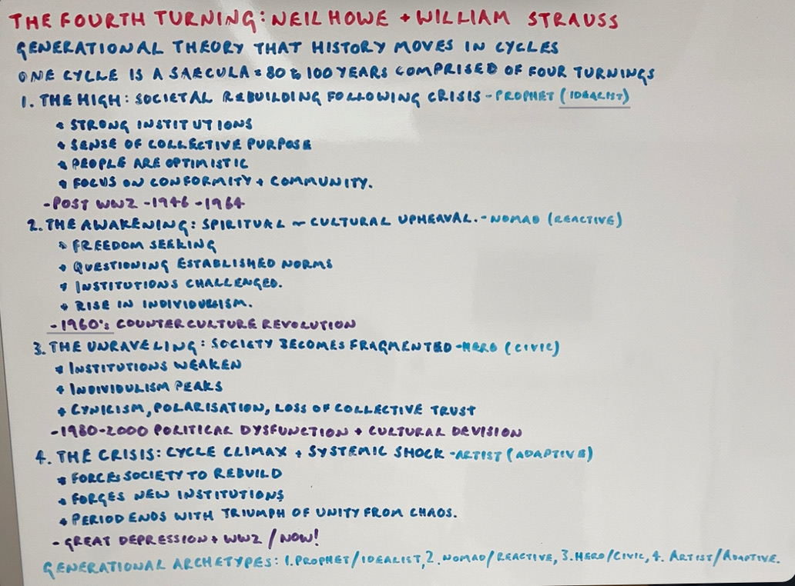

# The Fourth Turning: An Analysis of Cyclical History

## Authors: William Strauss & Neil Howe

??? tip "Listen to Luke read this Post"
    Click the play button below to listen to the audio version of this post.

    <audio controls>
      <source src="/assets/audio/Book Review - The Fourth Turning.m4a" type="audio/mp4">
      Your browser does not support the audio element.
    </audio>

## Gist

> Generational theory suggests that history moves in cycles. According to Strauss and Howe, we are currently in the Crisis phase of the Fourth Turning.

## Summary

The **Fourth Turning** argues that history follows a predictable cycle, divided into four generational archetypes **(Prophet, Nomad, Hero, Artist)** and four turnings or stages **(High, Awakening, Unraveling, Crisis)**. Each turning represents a different phase of social mood, driven by the behavior and values of the generations in power. Currently, we are in the "Fourth Turning" or Crisis phase, which will reshape society and create a new social order.

<!-- more -->

## Terms & Concepts

!!! info "Helpful Context & Definitions"
    - **Generational Archetypes**
        - Prophet (Idealist)
        - Nomad (Reactive)
        - Hero (Civic)
        - Artist (Adaptive)
    - **The Four Turnings**
        - The High
        - The Awakening
        - The Unraveling
        - The Crisis
    - One cycle = **Secular**, 80-100 years, comprised of four turnings.
    - One generation is 20-25 years, 1/4 of the secular.

## Ideas

1. **The High**: Societal rebuilding following a crisis *(Prophet, Idealist Archetype)*
    - Strong institutions and collective purpose.
        - *Example*: Post-WW2 (1946–1964).
   
2. **The Awakening**: Cultural upheaval *(Nomad, Reactive Archetype)*
    - Questioning norms, rise in individualism.
        - *Example*: 1960s counterculture revolution.
   
3. **The Unraveling**: Fragmentation of society *(Hero, Civic Archetype)*
    - Weakened institutions, peak individualism.
        - *Example*: 1980–2000, political dysfunction.
   
4. **The Crisis**: Systemic shock *(Artist, Adaptive Archetype)*
    - Rebuilding after societal collapse.
        - *Example*: Great Depression/WW2, current phase.

## Thoughts

1. **Relevance of Cycles in Modern Society**: The cyclical nature of history is particularly relevant today, aligning with the current social and political tensions of the "crisis" phase. Will this crisis lead to structural reform or just reset the cycle?
   
2. **Generational Leadership**: Transitioning leadership from Baby Boomers (Prophet) to Generation X (Nomad) and Millennials (Hero) could influence the societal response to crises.
   
3. **Predictive Power**: While the book claims predictive accuracy, history is shaped by unpredictable factors (e.g., technological advancements, environmental shifts). The framework is useful but not absolute.
   
4. **Crisis as a Catalyst for Innovation**: Historically, crises have sparked technological and social advancements. The current crisis could drive breakthroughs in sustainability, AI, and governance.
   
5. **Cross-Cultural Applicability**: The theory primarily focuses on Western societies, particularly the U.S. Can it apply to other cultural and political systems? The universality of the theory is debatable.

## Concluding Remark

The generational theory in *The Fourth Turning* provides a compelling framework for understanding society’s recurring patterns and future shifts, emphasizing the importance of recognizing these cyclical changes.

## Whiteboard

## Quotes

> History moves in cycles, and Winter is coming.

> Each generation’s response to the social moment shapes the next era.

## Reference Content

[The Fourth Turning - Wikipedia](https://en.wikipedia.org/wiki/Strauss–Howe_generational_theory)
[The Fourth Turning - YouTube](https://www.youtube.com/watch?v=LkmXwcglQhE)

## Review Status

- [x] Read the book
- [x] Summarized Content
- [ ] Critiqued Content
- [ ] Review 1 - Week
- [ ] Review 2 - Month
- [ ] Review 3 - Year
- [ ] Mind Map

---