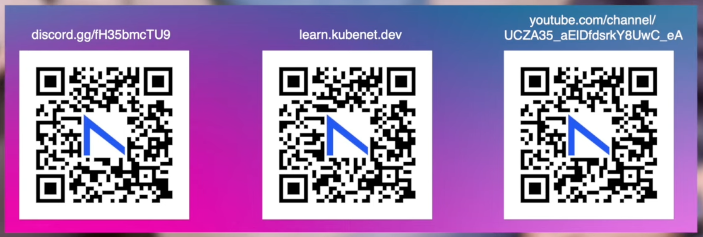

The [AutoCon](https://networkautomation.forum/autocon1) conferences have been remarkable gatherings of our network automation tribe. The [Network Automation Forum (NAF)](https://networkautomation.forum) has fostered an engaged, curious community that's pushing toward what's possible in automated network infrastructure. We’re all very thankful for the passion of [Chris](https://www.linkedin.com/in/cgrundemann/) & [Scott](https://www.linkedin.com/in/scottrobohn/) in their efforts to bring ‘*our people*’ together… and we hope they get very rich along the way! They deserve all the accolades, and more besides. *Take a Bow.* :boom:{ .bounce }  

??? question "Side Note: Help Me Understand the Money Flow - RFC"
    They say you should follow the money... and I’m eager to better grasp the macro economics of our sector in transition. A theme I’ll be exploring in more depth later. As my career progresses, i'm looking for ways to add extreme business value structurally - beyond incremental business efficiency in project delivery and design. I want to lead. My initial presumption is we are seeing a slow burn realignment of allocated capital that will be of great benefit to the thought leaders in our space. If anyone can help me understand this better… please reach out. 
    
    I’m patient - but I too would like to be rich before I die:

      - Being dirt poor... :material-check-bold:
      - Being able to feed myself... :material-check-bold: 
      - Being able for afford a Vision Pro & Cisco U subscription... :material-timer:{ .bounce } 

## NAFs Central Premise  

Let’s begin with the NAF's negatively framed tagline and central question: ***"Why hasn't network automation seen full adoption yet?”*** which is an appropriately provocative query that doubtless resonates but feels out of kilter, to me. Mostly because I believe we are in the **new golden era of networking**, filled with the most exciting tools, systems, and platforms, and an unprecedented tolerance for experimentation and failure. It’s ironic that many of the vendors we moan about as automation obstacles have, in their oligopolistic malaise, opened the market for the very companies sponsoring these conferences, allowing them to thrive in spaces previously under the iron fist of the big hardware players. 

These conferences are for engineers rather than companies so its appropriate to interrogate that question with more regard to our professional joy, as network tinkerers, as opposed to accrued business value, as corporate monsters... ultimately crucial though that is! And from that perspective, as far as I can tell, **everything is going great!** But I’m a moron so don’t listen to me. 

Let's get into what I’ve gathered from these conferences, focusing on my favorite presentations from the most recent [AutoCon1 in Amsterdam](https://networkautomation.forum/autocon1) (*because the content was much better than [AutoCon0 in Denver](https://networkautomation.forum/autocon2)*), before placing all this in the context of where I see network automation heading and drawing a quasi analogy to the current intellectual zeitgeist of societal loops and [The Four Turnings](https://en.wikipedia.org/wiki/Strauss–Howe_generational_theory). It’s a stretch... but it kinda fits. 

<!-- more -->

---

!!! info "The Cycle of Life (and Networks)"

    All that's old is new again. *Plan, Build, Operate*. *Design, Implement, Maintain*. *Prepare, Deploy, Manage*. *Architect, Execute, Optimize*. *Observe, Engage, Act*. We all have one of those circular diagrams. We've seen every iteration of them. We use them because they are true in some conceptual or actual sense. They're a compelling frame of reference for conveying what the hell is going on. And usually hide much murkiness. 

    ```mermaid
    graph LR
        A[Plan] --> B[Build] --> C[Operate] --> D[BLAH] --> E[to Infinity & Back]
    ```

    *Anyone noticed the migration back to CLI implementations abstracting new-fangled automation tools of late? All that's old is new again. Full circle. How Meta is that.*

---

## Dinesh the Contrarian

At AutoCon1, [Dinesh](https://www.linkedin.com/posts/ddutt_i-had-fun-chatting-with-zoe-and-chris-activity-7140418739560230913-ZkGd/) delivered a [compelling keynote](https://www.youtube.com/watch?v=rAVeiJdfAhk&list=PLP6VWb4PEbEoYgAivX69Br12nH1vtTBQr&index=6) with the tagline "A Contrarian Perspective". His use of the phrase, *“History doesn’t repeat, but it certainly rhymes,”* set the tone for a talk that challenged some of the conventional wisdom in network automation. And will assist me in folding in the Four Turnings analogy later in this post. 

My real time notes included:

1. **Primordial Soup**: He likened the rise of Network Engineers and Developers as evolving from the same "primordial soup," yet diverging into different technical lineages. Different species can’t reproduce!
  
2. **Configuration Management ≠ Automation**: Dinesh emphasized that configuration management isn’t real automation. Today, it’s more about validation - automating the processes that ensure configurations are correct and in line with policy.

3. **Python is the New OpenFlow**: One provocative statements was, "Python is the new OpenFlow." While Python has become a defacto tool for many, Dinesh warned that this won’t be the endgame. He compared Python to OpenFlow’s failure due to its high-level abstraction, implying that simply knowing Python isn’t sufficient.

4. **The Myth of a Uniform Data Model**: He argued that the industry’s dream of a uniform data model across vendors is a myth. Vendors will always vendor, meaning they’ll continue to prioritize their own ecosystems over true interoperability. Broken hearts all round. More on this later. 

5. **Avoid the Go-Lang Bandwagon**: Dinesh advised against pushing specific languages like Go-Lang without considering the bigger picture of where the industry came from versus where it’s headed. He drew an empathetic cord that spoke to people like me that love our field of play but are not genetically built for it. We need tools that democratize the playing field and are accessible to amateurs as well as *AutoGods*. Praise be upon him.   

This led to a deeper reflection on what the next generation of tools will be, coining the term `Tools 2.0`, a theme that continued in discussions throughout the conference. I presume his unsaid rift here is “Oh, [SuzieQ](https://github.com/netenglabs/suzieq), baby, (we should) love you”. And we really do, so Thank You!

---

## Claudia to the Moon

Among all the speakers, [Claudia De Luna](https://www.linkedin.com/in/claudiadeluna/) of [Gratuitous Arp](https://gratuitous-arp.net/thinking-about-network-automation-after-autocon1/), delivered what I believe was the [best talk of the AutoCons to date](https://www.youtube.com/watch?v=7wHZed__aJ8&list=PLP6VWb4PEbEoYgAivX69Br12nH1vtTBQr&index=21). She drew a powerful analogy between the stages of network automation maturity and the space flight missions that led to the Apollo moon landing.

My real time notes included:

1. **Mercury**: The early days of automation—akin to manually copying and pasting configurations. We were simply orbiting the earth, building basic scripts, and laying groundwork.
   
2. **Gemini**: This phase was about endurance—engineers started creating automation scripts that could be triggered manually but in a reliable way, much like the longer-duration Gemini missions that bridged the path to Apollo.
   
3. **Apollo**: Full automation, akin to landing on the moon. Fully automated workflows are triggered with minimal human intervention, solving complex problems autonomously.

**“Who really needs Apollo-level automation?”** Claudia challenged us, pointing out that some businesses are aiming for complete automation when, in reality, a more practical level of automation may be sufficient right now while we figure things out as a community and refine corporate ecosystems. 

It’s a question worth pondering: **How far do we actually need to go?** And more importantly, what’s the cost of pushing automation too far too soon in our current quasi nascent state?

!!! info "Claudia is Awesome :material-heart-pulse:{ .bounce }"
    I was fortunate to have the opportunity to interact with Claudia a bit during the Workshops in the days prior to the main conference. She was a stand out wonderful person I admired very much. She will be an essential resource and important player as we quest towards Mars. May the force be with her.   

---

## Wim Kubed the Network 

Thank You [Nokia](https://www.nokia.com/networks/)! By far the best of the Workshops was Nokia’s [Container Lab](https://containerlab.dev/manual/clabernetes/) session delivered by our communities shining light, [Roman](https://www.linkedin.com/in/rdodin/). What an incredibly impressive person he is. Respect. We have much to thank Nokia and its exceptional people for. Their approach to open sourcing community tools that deliver outstanding value and assist in building the automation ecosystem is a credit to clever capitalism done right. Container Lab is very well covered in a million community posts so I won’t spend any time on it here - other than to bridge this post toward [Wim](https://www.linkedin.com/in/wim-henderickx-393b3a/) and [Kubenet](https://learn.kubenet.dev) by linking to the latest iteration… [Clabernetes](https://containerlab.dev/manual/clabernetes/). *Check it out!*

One of the most impressive takeaways from AutoCon1 was [Wim's introduction of Kubenet](https://www.youtube.com/watch?v=s-XhzeF6BZ0), a new tool from Nokia. Wim, the Head of Technology and Architecture IP at Nokia, has been a shining light and thought leader within the NAF AutoCon community, much respected as an authority in the field. 

Wim opened his session by noting how Nokia's approach to making tools like Container Lab and [SR Linux](https://learn.srlinux.dev) freely available has been well-received by the community. He teased the audience by asking if we wanted more, to muted applause. Mostly because we are an introverted bunch incapable of expressing our emotions with appropriate flare. Inside we were all applauding rapturously, I’m sure. 

Wim’s presentation was delightfully paced. He took us through [Kubernetes](https://kubernetes.io) as a reference framework for Network Automation before expounding in more detail on how our community can leverage the Kubernetes ecosystem to do more than orchestrate containers and explained the path to Kubenet as a new tool for configuring Network devices. This is the promised land for those us who have spent the last decade tinkering with field adjacent activities like Dev-Ops, Cloud, SRE, etc & infinity. 

My real time notes included:

1. Wim began outlining Nokia’s approach to network automation requirements, stipulating that the new era must be:

    - **Consumable**: Meaning easy to access and tend to. We want to be able to  play with stuff on our laptops maintainably. 
    - **Predictable**: Meaning it should actually work. Nice to automate once but it must continue to work systemically.
    - **Collaborative**: Meaning we need change and version control via GitOps and associated audit trails. 
    - **Assisted**: Meaning it should leverage the power of AI as a buddy or helper without expecting closed loop AGI. A reassuringly practical take in an unrelentingly absurd zeitgeist period. 

2. Wim then outlined what [Kubernetes](https://kubernetes.io) does for us to achieve our before stated aims. Kubernetes as the platform to do network automation because it is **Open source**, **API Centric**, **Declarative**, **Extendable**, **Continuously Reconciliatory**, **Collaborative**, **Event Driven**, **AI Enabled**, and has a **Huge knowledge Base**. Boom! 

3. Wim tabled the current use cases of Kubernetes amongst our technical peers as a tool for automating and orchestrating *Containers, VMs, Clouds, Bare metal, Storage, Server workloads, Applications, mobile core/RAN and emergent AI use cases*… notice anything missing that is close to our hearts? Why can’t we leverage the outstandingly mature ecosystem of Kubernetes to automate our Networks? Awkward pause... Wim is a practical guy - so he birthed and built KubeNet himself! And all glory goes to him.   

4. **All these industries use Kubernetes so why not Networks?** Wim is on a mission so we can use Kubernetes to do just that. Dinesh would doubtless call this Tools 2.0. I would venture this is a giant leap, let’s be conservative and say Tools 2.5. As we will touch upon later in this post… some of us still have hope!  

**Making networks consumable with Kubernetes:**

As we’ve seen, many other industries are adopting Kubernetes and we don’t want networking to be left behind. Particularly given we have bunch of people on social media grabbing the limelight with the tagline takeaway from AutoCon0 in Denver: [“Make Network Engineering Cool Again!”](https://www.linkedin.com/feed/hashtag/?keywords=makenetworkengineeringcoolagain)

Wim impressed upon us a new frame of reference. We can think of Kubernetes as a container life cycle management tool, sure - got it. Kubenet at is core is not focused on that! Rather than delivering containers *Kubenet is delivering Network Artifacts*. Using Vendor, Abstract, and Automation layer APIs. So rather than instantiating a POD we are configuring network devices. Using APIs constructs to generate and push config to network boxes. Whoa!

Kubenet will take our protocol abstract parameters which form our intent and then build what we need for our network to operate. Then provide a continuous reconciliation loop to check what we have against what we want and keep it in sync. Lovely. :love_you_gesture:{ .bounce } 

I for one can’t wait to see this project develop. I encourage people to keep a keen eye on (frankly everything Nokia is doing) but Wim & Roman in particular are just straight forwardly smashing it. Well done. 

Kubenet is written in [Go](https://go.dev) and will need a scaled out Kubernetes cluster in production - maybe you’ll learn these skills (I’m trying) or otherwise throw it over the fence to your Dev-Ops or SRE Team. But it’s about time we leveraged the whole ecosystem from Kubernetes. And ***Kubenet will help us learn how to build APIs***. As this is required to define new services in Kubernetes. But don’t panic, Kubenet is an orchestrator so you can leverage [Python](https://www.python.org/doc/), [Ansible](https://docs.ansible.com), [Terraform](https://www.terraform.io) from Kubenet to bring the Network change to life. Exciting times. 

As Ethan said in the [Packet Pushers interview](https://www.youtube.com/watch?v=L97fg1kYXTs&t=35s) that followed the presentation  - this is A LOT! 

!!! note "Awe & Wonder Blooms"
    I’m currently in the awe and wonder naive and blissfully ignorant stage. I’m quite sure multitudinous skeptics and negative commentary will emerge that will prune my absurd expectations. I expect [AutoCon2 in Denver](https://networkautomation.forum/autocon2) this November to open my eyes to this project more. But right now I’m just grateful for Wim and everything Nokia are doing to bridge the gap to our dreams.

    Thank you. :material-heart:{ .bounce } 
    
    ??? info "Kubenet QR Code Links"
        
    
    

And now for my exquisitely profound *[(i’m British)](https://en.wikipedia.org/wiki/British_humour)* insight to bring this all together as we approach the *“moment of the conference”* and the <u>battle of accrued wisdom and naive hope</u>. AutoCon folklore starts here. 

## Automation - Lost in the Wash?

For those unfamiliar [The Fourth Turning](https://www.fourthturning.com) is a description of societal change through cycles. The intellectual zeitgeist posits we are currently living through the Crisis period where societies are forced to rebuild, new institutions are forged, and unity emerges from chaos. Is there an analogy to be drawn to our evolution from conventional Network Engineering to our new tribe of Network Automation professionals? *Kind of. Shaky. But i’ve started so I’ll finish.* 

**The High, The Awakening, The Unraveling, and The Crisis**

Applying this to the networking industry, it's tempting to claim we're at the **crisis point**. But are we really there yet? Perhaps we're still in the **Awakening** or **Unraveling** phase? Opinions welcome!

**The Awakening: Freedom-Seeking and Automation’s Emergence**

Currently, we see a surge in automation tools and a collective desire for **freedom** from traditional vendor constraints. Network engineers are actively experimenting with open-source projects and bespoke automation solutions, challenging the status quo. This mirrors the *Awakening* phase, where **norms are questioned** and **innovation flourishes**.

**The Unraveling: Institutions Weaken, Networks Break**

Alternatively, we might be in the *Unraveling* phase. Here, the institutions that once provided stability (traditional network vendors and their solutions) are weakening. We're witnessing the consequences of **fragmented automation efforts**, with individualized scripts and bespoke solutions leading to **fragile networks**.

**Not Quite the Crisis Yet**

While there's a palpable tension and concern about the future, it's arguable that we haven't hit the **Crisis** point. We’re in the midst of a transformation where the old ways are being questioned, and new practices are being formed. The **true crisis** would come when the **re-skilling** becomes required, and network engineers find themselves needing to pivot significantly or face obsolescence. Right now we are very much flourishing as far as I can tell. It's a choose your own adventure landscape. At some future point those choices may depart the stage.   

For now, we’re navigating the complexities and contradictions of these transitions, but we haven’t yet faced the full impact of what this automation-driven evolution will mean for the profession. I for one am totally cool with that. I suspect you are too. 

---

## Peter and the Pipedream  

**Towards the Moment of the Conference: “I couldn't disagree with you more”**

The moment of the conference came at the very end of AutoCon1, in the questions following Peter's [closing Keynote](https://www.youtube.com/watch?v=6mNLESvNuCs&t=2260s), which posed the question… “Are we building  Hall-9000 or Wall-E?” 

I was fortunate to attend the Workshops in the days proceeding the main conference. The Container Lab session from Nokia was the clear stand out. But [Peter](https://www.linkedin.com/in/boerspeter/), who is the Tech Lead of the Workflow Orchestrator Program at [SURF](https://www.surf.nl/en/themes/network) impressed with his demonstrable acumen and holistic orchestration perspective. Peter lives and breathes in the State sponsored and [QANGO](https://en.wikipedia.org/wiki/Quango) funded space. He is not subject to same commercial travails as most of us in the Enterprise & Telecoms money machines. Keep that in mind for later. 

Peter's talk on the emergence of AIOPs referenced the desired architectural flow of **Observe** > **Engage** > **Act**. He explained the inherent need and urgency to lean into this ML & LLM assisted approach - as statistically evidenced by the lack of talent entering the networking profession. A timely reminder of that recurrent message that we need to *Make Network Engineering Cool again*. There are simply not enough of us. 

??? example "An controversial take - I might get cancelled. It's supposed to be good natured. Trust. :pray:" 
    I have thoughts here - and a decidedly unpopular opinion I may develop another time… It’s gone down like a lead balloon when I've brought it up in water cooler conversations at the AutoCons so far. Which makes me nervous to talk openly about it, but the gist is: *We are no where close to as smart as we like to think we are!* This field is full of comparatively poor technologists by reference to most other adjacent technical domains. Ut oh - I said it. To be clear - I'm in the bottom percentile, and, other than me, absolutely everyone that participates in NAF is to be excluded. This is the impressive tip of our community. But many in our profession would not be capable of transitioning to a legit development role. My argument being I'm of the few self aware or stupid enough to say it out loud. Note the ironically funny feedback loop there. :turtle:{ .bounce } There is loads more nuance as i'm well aware there is a small segment of our profession that actually build the products or engineer very large and crazy complex networks. But the vast swathe of network engineers are working for small time companies or public bodies flipping ports and tickets for a living. I suspect as people drift toward seniority much of this is lost. I think what i'm saying here is please bear in mind you lot are the cerebral few. (Although i'd also note many of the best minds likely consider NAF a community of trivialities so i do need to refine my arguments here.)

Peters point was that it’s ridiculous to fear that AI will take our jobs. More likely, it will relieve some of the strain of an already lean and work burdened sector. We are all pretty bored of hearing this following the LLM early hype cycle so we can skip the detail.  

When I saw the AutoCon1 speakers list Peter's talk title stood out as the most intriguing. I assumed it would elucidate a narrative questioning if we are building high performance intelligent compute capable of solving real world problems akin to [Bostrom’s 2014 SuperIntelligence](../../books.md/#superintelligence) predictions (Hall-9000) or if, in actuality, LLM models are just the first publicly notorious form of ML that can do a few fun and fluffy things and not much more (WALL-E). Alas, Peters talk did not pan out that way. My disappointment in the moment was ultimately salvaged by the debate that followed. Sweet!

But before we get to that, it’s worth quickly summarizing Peter’s take on Hollywood's historic commentary on AI themes.  

My real time notes included:

**Good vs Evil:**

1. **WALL-E is fluffy and nice**: 
    - He compacts trash. He, It, They (insert ensuing controversy) were built to help and clean up the earth. 
    - Then glitched and became able to think for himself (What the hell is consciousness? Anyhow…). 
    - A human conception of the Archetypical hero. Heart warming stuff.  

2. **Hall-9000 is something scary**: 
    - A ‘cold blooded’ (isn’t language beautiful) task orientated machine that controls everything.
    - Built for “the accurate processing of information without distortion or concealment.” 
    - But it goes wrong. An order contradicts his directive. 
    - The ‘*Strange Loop*’ paradoxical feedback sets in with some ultimately harsh outcome for humankind. 

Peter declared that WALL-E & HALL-9000 started their life as good but malfunctioned into a stereotype. Before contextualising this to the here and now and our contemporary network automation agenda. So what now? Peter asked and answered - Intelligent Networks. ***AI will deliver the next paradigm***. 

Peter’s conclusion was that Hollywood AI stereotypes should be avoided. *(Shock horror. Not exactly the revelation I was hoping for. More a statement of the blindingly obvious.)* Instead we need AIOPs for mundane tasks, so we can tackle more complex tasks. A perfectly fine perspective although I’m intrigued to see how our definitions and conceptions of what complexity really is begin to break down in the coming years. Much is ponderously in flux right now. 

SURF already have fully orchestrated provisioning. As displayed in their workshop of the [Workflow Orchestrator](https://workfloworchestrator.org/about/) they have built. *You should check it out!*

Peters description of what SURF are building for the next Network Iteration of their high performance network is:

1. Open Source. “Need all the help we can get to build this thing.”
2. Keep it Simple - Make it Powerful. Start small and aim high. This is the path toward intelligent networks. 
3. Moving towards heterogeneous vendor agnostic architecture. Vendor X or Vendor Y -> and the AI still needs to exist.
4. A healthy service is described in multiple dimensions over time - which gets complicated. 
5. GNMI Telemetry.
6. Digital Twin for simulations and network planning. 

Peters description of his aims designing and building SURFs next generation of networks was building toward his ultimate thesis: 

**It has to be open source and open standards**. Therefore, Vendors need to provide us APIs that always look the same. Before declaring, with provocative emphasis, that Vendors need to support OpenConfig to enable multi vendor configuration. 

In summing up, Peter said Automation enables Orchestration so we can unlock the potential of an Intelligent Network. It was a decent talk. Good points well made. He must have been feeling good about himself. Respect. Applause ensued. We had made it to the end of the conference and he must have had every expectation there would be a few soft ball questions and notional praise for all the great work he had done at SURF to build such a high performant network machine. 

Then cometh Dinesh… **"I couldn’t disagree with you more.”** 

> “I couldn’t disagree with you more.  It’s really important to understand the context in which we operate.” :boom:{ .bounce }

I’ll paraphrase the rest of his awesome diatribe... 

> OpenConfig is zero. We have devices running that are a decades old. If it ain't broke don't fix mentalities mean these devices are not being replaced anytime soon. Dinesh insisted that the first thing we should stop as a community is continue our push to OpenConfig and other vendor agnostic plays. We need to stop harping on about the standard API because we are not going to get it. The longer we pursue this myth the longer we will be here asking why have we not seen full adoption of automation yet. We had the same problem from SNMP - it’s not changed. 

Of all the great lines being thrown back and forth during this wonderful exchange of frank opinions the most hilarious was:

Dinesh said: 

> “We somehow think we will tell the vendors to get together and sing Kumbaya - ain’t happening!” :laughing:{ .bounce }

To which Peter retorted: 

> “Maybe I am naive and young - but I do have some hope.” :heart_eyes:{ .bounce }

Before Wim chimed in to provide a bridge between Dinesh & Peter by suggesting, in ways evocative of his prior KubeNet remarks, that perhaps we as a community could get together and build an abstraction layer, for at least some of it. :brain:{ .bounce }

So what were we seeing here? People fighting for *their* Products. (*Noting that their products are, of course, the product of their reasoned and considered thoughts*) Just like every Vendor does:exclamation:{ .bounce }

- Dinesh has SuzieQ that is built around SSH discovery and interacting with Vendor CLI in order to be operable in the here and now. 

- Wim has KubeNet that will require the API abstraction layer to work. 

- Peter is building something shiny and new with vast quantities of public money that affords him the opportunity to think from first principles and behave aspiration-ally. *And so he bloody should!*

**People have different motivations and contexts.** I began this post by referencing the allocation of capital in our industry...

!!! success "Dinesh & Peter are BOTH CORRECT"
    My thought here is they are obviously both correct. It’s a question of perspective. The apparent disjunction between Dinesh & Peter is explained not just by the grizzled and wise vs young and hopeful thing. It’s a function of the sectors in which they have built extraordinarily successful careers. Dinesh is in the brown trenches, and Peter is in the green clouds. All thats old is new again. And ultimately - follow the money.   

*We need more Peters.* I'm proud of him for standing his ground to the extent he did. But, if it was me, i like to think I would have ripped Dinesh a new one - despite him being perfectly correct and sagely wise on the matter. **If educational co-operative institutions and the public sector is not pushing for open systems and vendor agnostic solutions then who the fuck is?** In Peter we trust. The personification of a vitally important component of our wonderful technology ecosystem. After all, Elon built SpaceX off the back off NASA and Government funding. I wonder how long before Claudia gets to add the Mars mission to her space & automation analogies.   

Whatever the truth and ultimate outcome… it was a great dialogue, as Scott made clear in his closing remark. A truly delightful exchange. **Thanks much Claudia, Dinesh, Peter & Wim**. I like to think we will reflect on this at AutoCon10. Or otherwise the robots at AutoCon1010. I wonder where we will be. 

by {{ git.author}} {{ git.author_email }}

