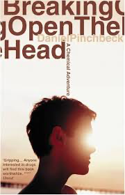

!!! tip "Welcome to My Book Shelf"
    Here you'll find a collection of books that I've read and recommend. 

    

!!! warning "Top Shelf Summarised below -> Bottom Shelf pending!"

### Team of Rivals

- :material-book: **Team of Rivals:** *The Political Genius of Abraham Lincoln*

    --- 

    [{ width="35px" align="right" }](https://www.amazon.com/Team-Rivals-Political-Abraham-Lincoln/dp/0743270754)

    **Author**: [Doris Kearns Goodwin](https://en.wikipedia.org/wiki/Doris_Kearns_Goodwin)  
    **Genre**: Biography, History

    ---

    **Team of Rivals** explores the leadership and political acumen of Abraham Lincoln. Goodwin delves into Lincoln’s relationships with his cabinet members, many of whom were former political rivals. The book showcases Lincoln’s ability to bring together opposing figures and turn them into collaborators who helped guide the country through the Civil War.

    ---

    **Why Read It?** This book is a must-read for those interested in leadership, diplomacy, and history. It offers valuable insights into Lincoln’s character and the power of collaboration in difficult times.

    ---

    :fontawesome-brands-amazon: [Purchase **Team of Rivals** on Amazon](https://www.amazon.com/Team-Rivals-Political-Abraham-Lincoln/dp/0743270754)

### Getting Better

- :material-book: **Getting Better:** *Why Global Development Is Succeeding*

    --- 

    [{ width="35px" align="right" }](https://www.amazon.com/Getting-Better-Development-Succeeding-Failed/dp/046503103X)

    **Author**: [Charles Kenny](https://en.wikipedia.org/wiki/Charles_Kenny)  
    **Genre**: Self-Help, Psychology

    ---

    **Getting Better** challenges the common narrative of global poverty and pessimism by presenting evidence that the world is improving in many important areas. Focusing on health, education, and access to technology, Charles Kenny argues that, despite slow economic growth, quality of life worldwide has been dramatically improving. This optimistic take on global development is backed by thoughtful analysis and data.  
    
    ---

    **Why Read It?** This book provides a refreshing, data-driven perspective on global development, offering hope for a better future. It's essential reading for anyone interested in economics, development, and policy.

    ---

    :fontawesome-brands-amazon: [Purchase **Getting Better** on Amazon](https://www.amazon.com/Getting-Better-Development-Succeeding-Failed/dp/046503103X)

### The Expanding Circle

- :material-book: **The Expanding Circle:** *Ethics, Evolution, and Moral Progress*

    --- 

    [{ width="35px" align="right" }](https://www.amazon.com/Expanding-Circle-Ethics-Evolution-Progress/dp/0691150699)

    **Author**: [Peter Singer](https://en.wikipedia.org/wiki/Peter_Singer)  
    **Genre**: Philosophy, Ethics

    ---

    **The Expanding Circle** is a thought-provoking exploration of the evolution of ethics and how humans have progressively expanded their moral concern beyond kin and tribe to include larger communities, animals, and even future generations. Peter Singer presents compelling insights into how reason drives the expansion of our moral circle, offering a roadmap for further moral progress.

    ---

    **Why Read It?** This book challenges readers to rethink the boundaries of their moral concern and provides a philosophical foundation for understanding moral progress. It's an essential read for those interested in ethics, philosophy, and human evolution.

    ---

    :fontawesome-brands-amazon: [Purchase **The Expanding Circle** on Amazon](https://www.amazon.com/Expanding-Circle-Ethics-Evolution-Progress/dp/0691150699)

### Breaking Open the Head

- :material-book: **Breaking Open the Head:** *A Psychedelic Journey into the Heart of Contemporary Shamanism*

    --- 

    [{ width="35px" align="right" }](https://www.amazon.com/Breaking-Open-Head-Contemporary-Shamanism/dp/0767907434)

    **Author**: [Daniel Pinchbeck](https://en.wikipedia.org/wiki/Daniel_Pinchbeck)  
    **Genre**: Spirituality, Anthropology

    ---

    **Breaking Open the Head** takes readers on a deep exploration of the intersection between psychedelics and shamanism. Daniel Pinchbeck embarks on a journey through indigenous cultures and Western history, investigating the use of psychedelics as tools for spiritual awakening and healing. The book combines personal narrative with research on the cultural and scientific significance of psychedelics in the modern world.

    ---

    **Why Read It?** This book offers an immersive dive into the world of psychedelics, their historical and cultural significance, and their potential to transform consciousness. A must-read for those interested in spirituality, alternative therapies, and shamanistic practices.

    ---

    :fontawesome-brands-amazon: [Purchase **Breaking Open the Head** on Amazon](https://www.amazon.com/Breaking-Open-Head-Contemporary-Shamanism/dp/0767907434)

### Lifespan

- :material-book: **Lifespan:** *Why We Age—and Why We Don’t Have To*

    --- 

    [{ width="35px" align="right" }](https://www.amazon.com/Lifespan-Why-Age-Dont-Have/dp/1501191977)

    **Author**: [David A. Sinclair, PhD](https://en.wikipedia.org/wiki/David_A._Sinclair)  
    **Genre**: Science, Health, Longevity

    ---

    **Lifespan** presents groundbreaking research into the biological processes of aging and makes the argument that aging is a disease that can be treated and even reversed. David Sinclair explores the science behind longevity and discusses genetic, lifestyle, and medical interventions that may allow humans to live longer, healthier lives. The book presents a hopeful vision of the future of aging.

    ---

    **Why Read It?** This book is a must-read for anyone interested in the science of aging, biotechnology, and the future of human health. It challenges the inevitability of aging and offers insights into how we might drastically extend human life expectancy.

    ---

    :fontawesome-brands-amazon: [Purchase **Lifespan** on Amazon](https://www.amazon.com/Lifespan-Why-Age-Dont-Have/dp/1501191977)

### Atomic Habits

- :material-book: **Atomic Habits:** *An Easy & Proven Way to Build Good Habits & Break Bad Ones*

    --- 

    [{ width="35px" align="right" }](https://www.amazon.com/Atomic-Habits-Proven-Build-Break/dp/0735211299)

    **Author**: [James Clear](https://en.wikipedia.org/wiki/James_Clear)  
    **Genre**: Self-Help, Psychology

    ---

    **Atomic Habits** is a practical guide to building better habits and breaking bad ones, based on the science of behavior change. James Clear explains how small, incremental changes—what he calls "atomic habits"—can compound into remarkable improvements over time. The book provides actionable strategies for overcoming bad habits, building new ones, and making lasting changes in your life. Clear combines research with practical examples to help readers understand how habits work and how to harness them to achieve their goals.

    ---

    **Why Read It?** If you're looking for a systematic, research-backed approach to self-improvement and habit formation, *Atomic Habits* offers clear, actionable advice that can lead to significant personal and professional growth.

    ---

    :fontawesome-brands-amazon: [Purchase **Atomic Habits** on Amazon](https://www.amazon.com/Atomic-Habits-Proven-Build-Break/dp/0735211299)

### Terraform: Up & Running

- :material-book: **Terraform: Up & Running (3rd Edition)**

    --- 

    [{ width="35px" align="right" }](https://www.amazon.com/Terraform-Running-Tools-Infrastructure-Production/dp/1098116747)

    **Author**: [Yevgeniy Brikman](https://www.linkedin.com/in/brikis98)  
    **Genre**: Technology, DevOps

    ---

    **Terraform: Up & Running** is the definitive guide to using Terraform, the open-source infrastructure as code software tool, for building, managing, and scaling cloud infrastructure. Yevgeniy Brikman provides practical, hands-on examples to help readers understand how to use Terraform to automate infrastructure on AWS, Google Cloud, Azure, and more. The third edition includes updates for the latest features of Terraform and expands on how to integrate Terraform into the DevOps lifecycle.

    ---

    **Why Read It?** If you're working in cloud infrastructure or DevOps, this book provides a comprehensive, practical guide to mastering Terraform, enabling you to efficiently build, manage, and scale your infrastructure.

    ---

    :fontawesome-brands-amazon: [Purchase **Terraform Up & Running (3rd Edition)** on Amazon](https://www.amazon.com/Terraform-Running-Tools-Infrastructure-Production/dp/1098116747)

### Learning Go

- :material-book: **Learning Go:** *An Idiomatic Approach to Real-World Go Programming*

    --- 

    [{ width="35px" align="right" }](https://www.amazon.com/Learning-Go-Idiomatic-Real-World-Programming/dp/1492077216)

    **Author**: [Jon Bodner](https://www.linkedin.com/in/jonbodner)  
    **Genre**: Technology, Programming

    ---

    **Learning Go** provides a comprehensive and idiomatic introduction to the Go programming language, focusing on real-world programming practices. Jon Bodner walks readers through Go's unique features, from its concurrency model to how it handles errors. This book is ideal for developers with some experience in other languages who want to build robust applications in Go. Bodner provides practical examples and explains the key concepts in an easy-to-understand manner.

    ---

    **Why Read It?** This book is an essential resource for anyone looking to get started with Go, one of the most popular languages for building scalable and efficient systems. It's packed with practical tips and real-world examples to help you become proficient in Go programming.

    ---

    :fontawesome-brands-amazon: [Purchase **Learning Go** on Amazon](https://www.amazon.com/Learning-Go-Idiomatic-Real-World-Programming/dp/1492077216)

### Network Programmability and Automation

- :material-book: **Network Programmability and Automation (2nd Edition):** *Skills for the Next-Generation Network Engineer* :material-heart:{ .bounce }

    --- 

    [{ width="35px" align="right" }](https://www.amazon.com/Network-Programmability-Automation-Next-Generation-Engineer/dp/1098110838/ref=sr_1_1?dib=eyJ2IjoiMSJ9.NRtSe45kPXlQJGEKxbO-yhbxRIVlAxk5YHo8etc0nYBFqT6jKfV9o8k0DBPFTbfAbZrO-LEz7PWZyy8BuRYlS-ZAT_wu6WpUDD2hxgbjqNPXX_6ajAuqdeFTMgYVfystI-8Z-UwN-07tkrxW3gG63DfVFwbSL9NZLCbJlnWQMQ5DimscUFmInfMYC_YpZDoSxHNBYy6nKlRgaTEpIFlPuA5jRARQneJp6LMzmBJ5HOU.6TrJ1yKZPaf4x8gOcPcTb0NKfzUS0hpKPAXkP94nSM4&dib_tag=se&keywords=network+programmability+and+automation&qid=1725990497&sr=8-1)

    **Authors**: [Christian Adell](https://x.com/chadell0),[Jason Edelman](https://www.jedelman.com), [Scott Lowe](https://www.linkedin.com/in/scottlowe/), [Matt Oswalt](https://www.linkedin.com/in/mattoswalt/)  
    **Genre**: Technology, Networking

    ---

    **Network Programmability and Automation (2nd Edition)** is a must-have for network engineers looking to evolve their skills for modern, automated networks. This book covers a broad range of network automation techniques, tools, and best practices, helping readers embrace the future of network engineering. From Python scripting and API-driven automation to tools like Ansible this edition updates the foundational skills needed to automate network infrastructure at scale.

    ---

    **Why Read It?** This book is essential for network engineers who want to stay ahead of the curve by learning how to automate and program networks. It's packed with real-world examples and practical knowledge that can help you modernize your networking skills and infrastructure.

    ---

    :fontawesome-brands-amazon: [Purchase **Network Programmability and Automation (2nd Edition)** on Amazon](https://www.amazon.com/Network-Programmability-Automation-Next-Generation-Engineer/dp/1098110838/ref=sr_1_1?dib=eyJ2IjoiMSJ9.NRtSe45kPXlQJGEKxbO-yhbxRIVlAxk5YHo8etc0nYBFqT6jKfV9o8k0DBPFTbfAbZrO-LEz7PWZyy8BuRYlS-ZAT_wu6WpUDD2hxgbjqNPXX_6ajAuqdeFTMgYVfystI-8Z-UwN-07tkrxW3gG63DfVFwbSL9NZLCbJlnWQMQ5DimscUFmInfMYC_YpZDoSxHNBYy6nKlRgaTEpIFlPuA5jRARQneJp6LMzmBJ5HOU.6TrJ1yKZPaf4x8gOcPcTb0NKfzUS0hpKPAXkP94nSM4&dib_tag=se&keywords=network+programmability+and+automation&qid=1725990497&sr=8-1)

### The Phoenix Project

- :material-book: **The Phoenix Project:** *A Novel About IT, DevOps, and Helping Your Business Win*

    --- 

    [{ width="35px" align="right" }](https://www.amazon.com/Phoenix-Project-DevOps-Helping-Business/dp/1942788290)

    **Authors**: [Gene Kim](https://en.wikipedia.org/wiki/Gene_Kim), Kevin Behr, George Spafford  
    **Genre**: Technology, DevOps, Business

    ---

    **The Phoenix Project** is a novel that introduces readers to the world of DevOps through a fictional narrative. It follows Bill, an IT manager tasked with saving a struggling project that is vital to the future of the business. As Bill implements DevOps principles, he and his team work to solve problems, streamline processes, and transform their organization. The book provides practical insights into how IT and business teams can collaborate more effectively to drive success.

    ---

    **Why Read It?** This book is perfect for anyone in IT or business leadership looking to understand how DevOps can drive efficiency and success. It provides a relatable, real-world application of DevOps principles in an engaging narrative format.

    ---

    :fontawesome-brands-amazon: [Purchase **The Phoenix Project** on Amazon](https://www.amazon.com/Phoenix-Project-DevOps-Helping-Business/dp/1942788290)

### The Staff Engineer's Path

- :material-book: **The Staff Engineer's Path:** *A Guide for Individual Contributors Navigating Growth and Change*

    --- 

    [{ width="35px" align="right" }](https://www.amazon.com/Staff-Engineers-Path-contributors-navigating/dp/1098118723)

    **Author**: [Tanya Reilly](https://www.linkedin.com/in/tanya-reilly/)  
    **Genre**: Technology, Engineering Leadership

    ---

    **The Staff Engineer's Path** provides practical advice for engineers navigating the complex role of a staff engineer. Tanya Reilly shares insights on how to grow as an individual contributor while also taking on leadership responsibilities. The book addresses how to influence, make decisions, and lead projects without moving into a traditional management role.

    ---

    **Why Read It?** This book is essential for software engineers and technical leaders who want to stay on the technical track while expanding their impact and leadership skills. It provides clear guidance on how to grow into senior engineering roles without becoming a manager.

    ---

    :fontawesome-brands-amazon: [Purchase **The Staff Engineer's Path** on Amazon](https://www.amazon.com/Staff-Engineers-Path-contributors-navigating/dp/1098118723)

### Energy and Civilization

- :material-book: **Energy and Civilization:** *A History*

    --- 

    [{ width="35px" align="right" }](https://www.amazon.com/Energy-Civilization-History-Vaclav-Smil/dp/0262536167)

    **Author**: [Vaclav Smil](https://en.wikipedia.org/wiki/Vaclav_Smil)  
    **Genre**: History, Science

    ---

    **Energy and Civilization** is a sweeping narrative of how energy has shaped human history. Vaclav Smil traces how societies have used energy—from human muscle and animal power to fossil fuels and modern renewables—and how energy transitions have driven economic, political, and social change. The book provides a deep understanding of the central role of energy in human progress and challenges.

    ---

    **Why Read It?** This book offers an insightful exploration of the role of energy in shaping civilization. It's essential for anyone interested in history, energy policy, and the future of energy in a rapidly changing world.

    ---

    :fontawesome-brands-amazon: [Purchase **Energy and Civilization** on Amazon](https://www.amazon.com/Energy-Civilization-History-Vaclav-Smil/dp/0262536167)

### The Progress Paradox

- :material-book: **The Progress Paradox:** *How Life Gets Better While People Feel Worse*

    --- 

    [{ width="35px" align="right" }](https://www.amazon.com/Progress-Paradox-Life-Gets-Better/dp/0812973038)

    **Author**: [Gregg Easterbrook](https://en.wikipedia.org/wiki/Gregg_Easterbrook)  
    **Genre**: Sociology, Psychology

    ---

    **The Progress Paradox** explores the paradoxical relationship between material prosperity and personal satisfaction. Gregg Easterbrook argues that, despite unprecedented advances in wealth, health, and technology, people in modern societies report feeling less happy and more dissatisfied. Through data, anecdotes, and social theory, the book challenges the reader to rethink their assumptions about progress and happiness.

    ---

    **Why Read It?** This book offers a thought-provoking take on why increased wealth and technological advancement don’t always lead to greater happiness. It's essential reading for anyone interested in psychology, sociology, and the nature of human fulfillment.

    ---

    :fontawesome-brands-amazon: [Purchase **The Progress Paradox** on Amazon](https://www.amazon.com/Progress-Paradox-Life-Gets-Better/dp/0812973038)

### The Rational Optimist

- :material-book: **The Rational Optimist:** *How Prosperity Evolves*

    --- 

    [{ width="35px" align="right" }](https://www.amazon.com/Rational-Optimist-Prosperity-Evolves-P-S/dp/0061452068)

    **Author**: [Matt Ridley](https://en.wikipedia.org/wiki/Matt_Ridley)  
    **Genre**: Economics, History, Sociology

    ---

    **The Rational Optimist** by Matt Ridley presents an argument for optimism about the future based on historical and contemporary trends. Ridley explains how human innovation, trade, and cooperation have consistently improved standards of living throughout history, and he suggests that this trend is likely to continue. The book challenges pessimistic views of the world and argues that, despite present challenges, the future holds even greater potential for prosperity.

    ---

    **Why Read It?** This book provides a refreshing and well-researched take on why humanity’s long-term progress is reason for optimism. It's a must-read for those interested in economics, history, and the dynamics of human progress.

    ---

    :fontawesome-brands-amazon: [Purchase **The Rational Optimist** on Amazon](https://www.amazon.com/Rational-Optimist-Prosperity-Evolves-P-S/dp/0061452068)

### The Cosmic Serpent

- :material-book: **The Cosmic Serpent:** *DNA and the Origins of Knowledge*

    --- 

    [{ width="35px" align="right" }](https://www.amazon.com/Cosmic-Serpent-DNA-Origins-Knowledge/dp/0874779642)

    **Author**: [Jeremy Narby](https://en.wikipedia.org/wiki/Jeremy_Narby)  
    **Genre**: Anthropology, Biology, Spirituality

    ---

    **The Cosmic Serpent** explores the connection between shamanistic practices and molecular biology. Jeremy Narby draws on his experiences with indigenous shamans in the Amazon and suggests that DNA and life itself may be encoded in the visions induced by hallucinogenic plants. He provides a provocative theory linking ancient spiritual wisdom with modern biology, suggesting that shamans have been accessing knowledge about DNA for thousands of years.

    ---

    **Why Read It?** This book is a fascinating exploration of the intersection between science and spirituality. It's ideal for readers interested in anthropology, molecular biology, and alternative ways of understanding knowledge and consciousness.

    ---

    :fontawesome-brands-amazon: [Purchase **The Cosmic Serpent** on Amazon](https://www.amazon.com/Cosmic-Serpent-DNA-Origins-Knowledge/dp/0874779642)

### The Greatest Show on Earth

- :material-book: **The Greatest Show on Earth:** *The Evidence for Evolution*

    --- 

    [{ width="35px" align="right" }](https://www.amazon.com/Greatest-Show-Earth-Evidence-Evolution/dp/1416594787)

    **Author**: [Richard Dawkins](https://en.wikipedia.org/wiki/Richard_Dawkins)  
    **Genre**: Science, Biology, Evolution

    ---

    **The Greatest Show on Earth** by Richard Dawkins is a comprehensive defense of the theory of evolution. Dawkins systematically presents the overwhelming evidence for evolution, from fossil records to molecular biology, showing that evolution is not just a theory but a well-supported fact. The book is both a scientific exploration and a passionate argument for understanding and appreciating the beauty of life's evolutionary history.

    ---

    **Why Read It?** This book is an essential read for anyone interested in understanding the evidence behind evolution. Richard Dawkins' clear, engaging writing makes complex scientific concepts accessible to a broad audience, offering both knowledge and inspiration.

    ---

    :fontawesome-brands-amazon: [Purchase **The Greatest Show on Earth** on Amazon](https://www.amazon.com/Greatest-Show-Earth-Evidence-Evolution/dp/1416594787)

### Sapiens

- :material-book: **Sapiens:** *A Brief History of Humankind*

    --- 

    [{ width="35px" align="right" }](https://www.amazon.com/Sapiens-Humankind-Yuval-Noah-Harari/dp/0062316095)

    **Author**: [Yuval Noah Harari](https://en.wikipedia.org/wiki/Yuval_Noah_Harari)  
    **Genre**: History, Anthropology, Sociology

    ---

    **Sapiens** takes readers on a sweeping journey through the history of humanity, from the evolution of archaic human species to the present day. Yuval Noah Harari explores how Homo sapiens came to dominate the planet, the rise of civilizations, the development of religions, and the future challenges humanity faces. The book combines history, biology, anthropology, and sociology to offer a thought-provoking perspective on human progress.

    ---

    **Why Read It?** This book is a must-read for anyone interested in the history and future of humanity. Harari’s engaging writing and broad scope make complex historical and scientific ideas accessible, sparking deep reflection on where we’ve been and where we’re headed.

    ---

    :fontawesome-brands-amazon: [Purchase **Sapiens** on Amazon](https://www.amazon.com/Sapiens-Humankind-Yuval-Noah-Harari/dp/0062316095)

### The Ten Types of Human 

- :material-book: **The Ten Types of Human:** *Who We Are and Who We Can Be*

    --- 

    [{ width="35px" align="right" }](https://www.amazon.com/Ten-Types-Human-Story-We/dp/1784704863)

    **Author**: [Dexter Dias](https://en.wikipedia.org/wiki/Dexter_Dias)  
    **Genre**: Psychology, Sociology, Anthropology

    ---

    **The Ten Types of Human** by Dexter Dias is a fascinating exploration of the human mind and behavior. Dias combines stories from across the globe with cutting-edge research to explore ten fundamental types of human behavior and personality. He delves into the psychology of empathy, cruelty, courage, and fear, presenting a powerful reflection on what it means to be human and how understanding these traits can help us navigate our modern world.

    ---

    **Why Read It?** This book provides deep insights into human nature and behavior, offering readers a unique way to understand themselves and others. It's ideal for those interested in psychology, sociology, and anthropology.

    ---

    :fontawesome-brands-amazon: [Purchase **The Ten Types of Human** on Amazon](https://www.amazon.com/Ten-Types-Human-Story-We/dp/1784704863)

### On Anarchism

- :material-book: **On Anarchism**

    --- 

    [{ width="35px" align="right" }](https://www.amazon.com/Anarchism-Noam-Chomsky/dp/1595589104)

    **Author**: [Noam Chomsky](https://en.wikipedia.org/wiki/Noam_Chomsky)  
    **Genre**: Politics, Philosophy

    ---

    **On Anarchism** is a collection of writings by Noam Chomsky that explores the principles and philosophy of anarchism. Chomsky presents a compelling case for anarchism as a way of organizing society that emphasizes freedom, equality, and opposition to all forms of unjust authority. The book serves as both an introduction to anarchist thought and a deep dive into Chomsky’s own views on the subject.

    ---

    **Why Read It?** This book offers a thought-provoking perspective on political theory and anarchism, especially for readers interested in alternative political philosophies. Chomsky’s clear and powerful writing makes complex ideas accessible, providing insight into one of the most influential political thinkers of our time.

    ---

    :fontawesome-brands-amazon: [Purchase **On Anarchism** on Amazon](https://www.amazon.com/Anarchism-Noam-Chomsky/dp/1595589104)

### God Is Not Great

- :material-book: **God Is Not Great:** *How Religion Poisons Everything*

    --- 

    [{ width="35px" align="right" }](https://www.amazon.com/God-Not-Great-Religion-Everything/dp/0446697966)

    **Author**: [Christopher Hitchens](https://en.wikipedia.org/wiki/Christopher_Hitchens) :material-grave-stone:{ .bounce} :material-heart:{ .bounce} 

    **Genre**: Religion, Philosophy

    ---

    **God Is Not Great** is a sharp critique of organized religion by Christopher Hitchens. Hitchens argues that religion is not only irrational but also harmful to individuals and societies. Through a mix of historical examples and contemporary observations, he explores how religion has been used to justify oppression, violence, and ignorance, while advocating for a secular and rational worldview.

    ---

    **Why Read It?** This book offers a thought-provoking and controversial perspective on religion and its influence on society. Hitchens' witty and incisive writing makes complex topics accessible, encouraging readers to critically evaluate the role of religion in the modern world.

    ---

    :fontawesome-brands-amazon: [Purchase **God Is Not Great** on Amazon](https://www.amazon.com/God-Not-Great-Religion-Everything/dp/0446697966)

### Money

- :material-book: **Money:** *The True Story of a Made-Up Thing*

    --- 

    [{ width="37px" align="right" }](https://www.amazon.com/Money-True-Story-Made-Up-Thing/dp/031641719X)

    **Author**: [Jacob Goldstein](https://en.wikipedia.org/wiki/Jacob_Goldstein)  
    **Genre**: Economics, History

    ---

    **Money** by Jacob Goldstein explores the history of money, tracing how something that started as a way to trade goods and services has evolved into one of the most powerful forces in the modern world. Goldstein explains the origins, transformations, and significance of money in a way that is both engaging and informative, making complex financial concepts accessible to the general reader.

    ---

    **Why Read It?** This book offers a fascinating and easy-to-read history of money and its evolution. It’s a must-read for anyone interested in economics, history, or the way financial systems shape our world.

    ---

    :fontawesome-brands-amazon: [Purchase **Money** on Amazon](https://www.amazon.com/Money-True-Story-Made-Up-Thing/dp/031641719X)

### Mind Body Problems

- :material-book: **Mind Body Problems:** *Science, Subjectivity, & Who We Really Are*

    --- 

    [{ width="37px" align="right" }](https://www.amazon.com/Mind-Body-Problems-Science-Subjectivity-Really/dp/1731440480/ref=sr_1_4?crid=2VYKWFPE32FVG&dib=eyJ2IjoiMSJ9.M7A9pTNbHoqVOlh--9XtTZV8mcfCdSM2onkPFA7lZ4RZKXlTf9Bv4TvdSNWap20KvTEUOi-qGcRE5lVsJ-S6A9LwbHNKGC2doIuvjYebQBZnVTr915u0wPBi5OTg5vnCdMD2avhG1JxxDlaVFKkc6zh7hgb_mqGSDkpZLna1K7gEA0LqAtFlhKu2Ik5zLCXAcKRyHIkuEXZoCa0AOxAdazY2zzSsQlIWtdfdM05XVNg.SyAhxeulbRbamOmOJt9SeG-xPrIHA8fHcoEKbzygLBM&dib_tag=se&keywords=mind+body+problems&qid=1726002775&s=books&sprefix=mind+body+problems%2Cstripbooks-intl-ship%2C176&sr=1-4)

    **Author**: [John Horgan](https://en.wikipedia.org/wiki/John_Horgan_(science_journalist))  
    **Genre**: Psychology, Neuroscience, Philosophy

    ---

    **Mind Body Problems** by John Horgan delves into the complex relationship between the mind and body, questioning how science, subjectivity, and consciousness intertwine. Horgan interviews leading scientists and philosophers to explore how they grapple with these fundamental questions, blending personal reflections with scientific insights to provide a thought-provoking examination of who we are.

    ---

    **Why Read It?** This book is ideal for those interested in the intersection of neuroscience, psychology, and philosophy. Horgan’s accessible writing style and exploration of deep, existential questions make it a compelling read for anyone curious about the mind-body problem.

    ---

    :fontawesome-brands-amazon: [Purchase **Mind Body Problems** on Amazon](https://www.amazon.com/Mind-Body-Problems-Science-Subjectivity-Really/dp/1731440480/ref=sr_1_4?crid=2VYKWFPE32FVG&dib=eyJ2IjoiMSJ9.M7A9pTNbHoqVOlh--9XtTZV8mcfCdSM2onkPFA7lZ4RZKXlTf9Bv4TvdSNWap20KvTEUOi-qGcRE5lVsJ-S6A9LwbHNKGC2doIuvjYebQBZnVTr915u0wPBi5OTg5vnCdMD2avhG1JxxDlaVFKkc6zh7hgb_mqGSDkpZLna1K7gEA0LqAtFlhKu2Ik5zLCXAcKRyHIkuEXZoCa0AOxAdazY2zzSsQlIWtdfdM05XVNg.SyAhxeulbRbamOmOJt9SeG-xPrIHA8fHcoEKbzygLBM&dib_tag=se&keywords=mind+body+problems&qid=1726002775&s=books&sprefix=mind+body+problems%2Cstripbooks-intl-ship%2C176&sr=1-4)

### Impromptu

- :material-book: **Impromptu:** *Amplifying Our Humanity Through AI*

    --- 

    [{ width="37px" align="right" }](https://www.amazon.com/Impromptu-Amplifying-Our-Humanity-Through/dp/B0BYLSCPPV/ref=sr_1_1?crid=1O05FOLMU8EUU&dib=eyJ2IjoiMSJ9.-wVmPzOLWQi0EUDkH5j16MHlbNRdkIv8R07FBwbQQYXJxbiSFnVxDRIBuNHd7KaQd6GTZPxtX8-rW_3mBhtXcZjmyfSmh0W71QyevDIs8XIeD8IHU0VdZVJCXoiAGNhQ5wClZsBlq2z0dtUQMxnDcuTSiSBi4BG_KcvyNcJv8yNTncVEfplL09R7VmwJkeHymIoVKMi_3GkldyeeguHqcVZnVrF174CSDj79QjXaEn4.xn5ujcIoBZIsWzeZzkrAIsVt8-ViW_JhoBRAhRPCqRQ&dib_tag=se&keywords=impromptu&qid=1726003040&s=books&sprefix=impromtu%2Cstripbooks-intl-ship%2C196&sr=1-1)

    **Author**: [Reid Hoffman](https://en.wikipedia.org/wiki/Reid_Hoffman)  
    **Genre**: Technology, Artificial Intelligence

    ---

    **Impromptu** by Reid Hoffman explores how artificial intelligence (AI) can be used to amplify human potential. Hoffman, a co-founder of LinkedIn and an advocate of AI, argues that AI will not replace humans but rather enhance creativity, productivity, and problem-solving. Through thoughtful analysis and practical examples, the book presents a positive outlook on AI's role in shaping the future.

    ---

    **Why Read It?** This book is a must-read for those interested in understanding the positive potential of AI. Hoffman provides a balanced, optimistic perspective on how AI can be harnessed to improve our personal and professional lives, making it ideal for tech enthusiasts and skeptics alike.

    ---

    :fontawesome-brands-amazon: [Purchase **Impromptu** on Amazon](https://www.amazon.com/Impromptu-Amplifying-Our-Humanity-Through/dp/B0BYLSCPPV/ref=sr_1_1?crid=1O05FOLMU8EUU&dib=eyJ2IjoiMSJ9.-wVmPzOLWQi0EUDkH5j16MHlbNRdkIv8R07FBwbQQYXJxbiSFnVxDRIBuNHd7KaQd6GTZPxtX8-rW_3mBhtXcZjmyfSmh0W71QyevDIs8XIeD8IHU0VdZVJCXoiAGNhQ5wClZsBlq2z0dtUQMxnDcuTSiSBi4BG_KcvyNcJv8yNTncVEfplL09R7VmwJkeHymIoVKMi_3GkldyeeguHqcVZnVrF174CSDj79QjXaEn4.xn5ujcIoBZIsWzeZzkrAIsVt8-ViW_JhoBRAhRPCqRQ&dib_tag=se&keywords=impromptu&qid=1726003040&s=books&sprefix=impromtu%2Cstripbooks-intl-ship%2C196&sr=1-1)

### Superintelligence

- :material-book: **Superintelligence:** *Paths, Dangers, Strategies*

    --- 

    [{ width="37px" align="right" }](https://www.amazon.com/Superintelligence-Dangers-Strategies-Nick-Bostrom/dp/0198739834)

    **Author**: [Nick Bostrom](https://en.wikipedia.org/wiki/Nick_Bostrom)  
    **Genre**: Artificial Intelligence, Philosophy, Future Studies

    ---

    **Superintelligence** by Nick Bostrom investigates the future of artificial intelligence and the potential risks associated with the development of AI systems that surpass human intelligence. Bostrom discusses various paths that AI development could take, the dangers of uncontrolled superintelligence, and the strategies humanity can adopt to mitigate these risks. The book offers a comprehensive look at one of the most critical issues of our time.

    ---

    **Why Read It?** This book is essential for anyone interested in the future of AI and its implications for humanity. Bostrom’s deep exploration of AI risks and strategies makes it a must-read for technologists, philosophers, and policy makers alike.

    ---

    :fontawesome-brands-amazon: [Purchase **Superintelligence** on Amazon](https://www.amazon.com/Superintelligence-Dangers-Strategies-Nick-Bostrom/dp/0198739834)

### Glucose Revolution

- :material-book: **Glucose Revolution:** *The Life-Changing Power of Balancing Your Blood Sugar*

    --- 

    [{ width="37px" align="right" }](https://www.amazon.com/Glucose-Revolution-Life-Changing-Power-Balancing/dp/1982179414)

    **Author**: [Jessie Inchauspé](https://en.wikipedia.org/wiki/Jessie_Inchausp%C3%A9)  
    **Genre**: Health, Nutrition

    ---

    **Glucose Revolution** by Jessie Inchauspé provides practical advice on how balancing your blood sugar can significantly improve your health, energy levels, and mood. Inchauspé explains the science behind blood sugar spikes and offers tips on how to manage them through simple changes in diet and lifestyle. The book is filled with actionable advice, making it accessible to anyone looking to take control of their health.

    ---

    **Why Read It?** This book is essential for those interested in health and nutrition, offering scientifically-backed strategies to manage blood sugar and improve well-being. It’s a practical guide that can make a lasting impact on your health.

    ---

    :fontawesome-brands-amazon: [Purchase **Glucose Revolution** on Amazon](https://www.amazon.com/Glucose-Revolution-Life-Changing-Power-Balancing/dp/1982179414)

### The Talent Code

- :material-book: **The Talent Code:** *Greatness Isn't Born. It's Grown. Here's How.*

    --- 

    [{ width="37px" align="right" }](https://www.amazon.com/Talent-Code-Greatness-Born-Grown/dp/055380684X)

    **Author**: [Daniel Coyle](https://en.wikipedia.org/wiki/Daniel_Coyle)  
    **Genre**: Psychology, Personal Development

    ---

    **The Talent Code** by Daniel Coyle explores the science behind talent development and how greatness is nurtured, not born. Coyle delves into how myelin (the insulation around nerve fibers) plays a critical role in skill development and offers insights into how anyone can improve their abilities through deep practice, motivation, and master coaching.

    ---

    **Why Read It?** This book is a must-read for anyone looking to understand how talent develops and how to improve personal skills. It’s perfect for athletes, musicians, educators, and anyone seeking to unlock their potential.

    ---

    :fontawesome-brands-amazon: [Purchase **The Talent Code** on Amazon](https://www.amazon.com/Talent-Code-Greatness-Born-Grown/dp/055380684X)

### Cosmos

- :material-book: **Cosmos**

    --- 

    [{ width="37px" align="right" }](https://www.amazon.com/Cosmos-Carl-Sagan/dp/0345331354)

    **Author**: [Carl Sagan](https://en.wikipedia.org/wiki/Carl_Sagan)  
    **Genre**: Science, Astronomy, Philosophy

    ---

    **Cosmos** by Carl Sagan is a groundbreaking work that explores the vastness of the universe and humanity’s place within it. Sagan eloquently discusses a range of topics from astronomy to the evolution of life, blending scientific knowledge with a sense of wonder and philosophical inquiry. The book is a companion to the acclaimed television series of the same name and is a must-read for anyone interested in science and our place in the cosmos.

    ---

    **Why Read It?** This book offers a profound and inspiring journey through the universe, combining scientific facts with philosophical reflections. Sagan’s writing makes complex ideas accessible to a wide audience, sparking curiosity and awe.

    ---

    :fontawesome-brands-amazon: [Purchase **Cosmos** on Amazon](https://www.amazon.com/Cosmos-Carl-Sagan/dp/0345331354)

### The Hunter-Gatherer's Guide to the 21st Century

- :material-book: **The Hunter-Gatherer's Guide to the 21st Century:** *Evolution and the Challenges of Modern Life*

    --- 

    [{ width="37px" align="right" }](https://www.amazon.com/Hunter-Gatherers-Guide-21st-Century-Evolution/dp/0593086880)

    **Authors**: [Heather Heying](https://en.wikipedia.org/wiki/Heather_Heying), [Bret Weinstein](https://en.wikipedia.org/wiki/Bret_Weinstein)  
    **Genre**: Science, Evolution, Social Commentary

    ---

    **The Hunter-Gatherer's Guide to the 21st Century** explores how the human brain and body, shaped by millions of years of evolution, are poorly suited to the complexities of modern life. Heather Heying and Bret Weinstein, evolutionary biologists, examine how evolutionary mismatches between our hunter-gatherer ancestors and our high-tech society impact everything from relationships to health, offering practical insights for thriving in the modern world.

    ---

    **Why Read It?** This book offers a unique evolutionary perspective on the challenges of modern life. It’s a must-read for anyone interested in science, human behavior, and how our evolutionary past affects the present.

    ---

    :fontawesome-brands-amazon: [Purchase **The Hunter-Gatherer's Guide to the 21st Century** on Amazon](https://www.amazon.com/Hunter-Gatherers-Guide-21st-Century-Evolution/dp/0593086880)

### Build a Mathematical Mind

- :material-book: **Build a Mathematical Mind:** *Even If You Think You Can't*

    --- 

    [{ width="37px" align="right" }](https://www.amazon.com/Build-Mathematical-Mind-Detective-Critical-ebook/dp/B0BTB8H4Z8/)

    **Author**: [Albert Rutherford](https://www.amazon.com/stores/Albert-Rutherford/author/B07HLN6LJC)  
    **Genre**: Education, Mathematics, Self-Help

    ---

    **Build a Mathematical Mind** offers practical insights into how anyone can improve their mathematical thinking, even if they feel they lack natural talent in the subject. Albert Rutherford provides strategies and advice for overcoming math anxiety and building a stronger, more confident mathematical mindset, showing that everyone can learn to appreciate and excel in math.

    ---

    **Why Read It?** This book is perfect for anyone looking to boost their mathematical skills and mindset. Whether you're a student, educator, or someone who has struggled with math, Rutherford’s accessible approach makes math less intimidating and more engaging.

    ---

    :fontawesome-brands-amazon: [Purchase **Build a Mathematical Mind** on Amazon](https://www.amazon.com/Build-Mathematical-Mind-Detective-Critical-ebook/dp/B0BTB8H4Z8/)

### The Coming Wave

- :material-book: **The Coming Wave:** *Technology, Power, and the Twenty-First Century's Greatest Dilemma*

    --- 

    [{ width="37px" align="right" }](https://www.amazon.co.uk/Coming-Wave-instant-bestseller-ultimate/dp/1529923832/)

    **Author**: [Mustafa Suleyman](https://en.wikipedia.org/wiki/Mustafa_Suleyman)  
    **Genre**: Technology, Futurism

    ---

    **The Coming Wave** by Mustafa Suleyman examines how emerging technologies such as artificial intelligence, genetic engineering, and advanced computing will shape the 21st century. Suleyman explores the ethical and societal challenges that accompany these powerful innovations, arguing that humanity must learn to control the wave of technological change before it controls us.

    ---

    **Why Read It?** This book is a must-read for anyone interested in the future of technology, power, and ethics. Suleyman provides a nuanced look at the opportunities and risks posed by emerging technologies, making it a crucial resource for technologists, policymakers, and futurists alike.

    ---

    :fontawesome-brands-amazon: [Purchase **The Coming Wave** on Amazon](https://www.amazon.co.uk/Coming-Wave-instant-bestseller-ultimate/dp/1529923832/)

### Enlightenment Now

- :material-book: **Enlightenment Now:** *The Case for Reason, Science, Humanism, and Progress*

    --- 

    [{ width="37px" align="right" }](https://www.amazon.com/Enlightenment-Now-Science-Humanism-Progress/dp/0525427570)

    **Author**: [Steven Pinker](https://en.wikipedia.org/wiki/Steven_Pinker)  
    **Genre**: Science, Philosophy, History

    ---

    **Enlightenment Now** by Steven Pinker argues that the ideals of the Enlightenment—reason, science, humanism, and progress—are the keys to continuing human advancement. Pinker presents data-driven evidence to show that, despite widespread pessimism, the world is improving in terms of health, prosperity, safety, and overall well-being, thanks to the principles of the Enlightenment.

    ---

    **Why Read It?** This book is a powerful and optimistic defense of modernity, ideal for readers who want a hopeful perspective on the future. Pinker’s work is a must-read for those interested in philosophy, science, and the forces that drive human progress.

    ---

    :fontawesome-brands-amazon: [Purchase **Enlightenment Now** on Amazon](https://www.amazon.com/Enlightenment-Now-Science-Humanism-Progress/dp/0525427570)

### The Age of Surveillance Capitalism

- :material-book: **The Age of Surveillance Capitalism:** *The Fight for a Human Future at the New Frontier of Power*

    --- 

    [{ width="37px" align="right" }](https://www.amazon.com/Age-Surveillance-Capitalism-Future-Frontier/dp/1610395697)

    **Author**: [Shoshana Zuboff](https://en.wikipedia.org/wiki/Shoshana_Zuboff)  
    **Genre**: Technology, Politics, Economics

    ---

    **The Age of Surveillance Capitalism** by Shoshana Zuboff explores how modern tech companies harvest, exploit, and monetize personal data to create unprecedented power structures. Zuboff argues that surveillance capitalism represents a new form of economic order that challenges individual autonomy, democracy, and privacy. This deeply researched work is a wake-up call about the growing power of corporations in the digital age.

    ---

    **Why Read It?** This book is essential for anyone concerned about privacy, data exploitation, and the future of democracy in the digital era. Zuboff’s work provides a profound critique of the way modern capitalism operates through surveillance.

    ---

    :fontawesome-brands-amazon: [Purchase **The Age of Surveillance Capitalism** on Amazon](https://www.amazon.com/Age-Surveillance-Capitalism-Future-Frontier/dp/1610395697)

### In Search of Schrödinger's Cat

- :material-book: **In Search of Schrödinger's Cat:** *Quantum Physics and Reality*

    --- 

    [{ width="37px" align="right" }](https://www.amazon.com/Search-Schrodingers-Cat-Quantum-Physics/dp/0553342533)

    **Author**: [John Gribbin](https://en.wikipedia.org/wiki/John_Gribbin)  
    **Genre**: Science, Physics, Quantum Mechanics

    ---

    **In Search of Schrödinger's Cat** by John Gribbin is a classic introduction to quantum mechanics, explaining the bizarre and fascinating world of subatomic particles. Gribbin unpacks the famous Schrödinger's cat paradox and explores the implications of quantum theory for our understanding of reality, providing an accessible entry point into one of the most complex scientific fields.

    ---

    **Why Read It?** This book is perfect for readers who are curious about quantum physics and want a clear, engaging explanation of its concepts. Gribbin’s ability to make complex ideas understandable makes this a must-read for anyone interested in science and the nature of reality.

    ---

    :fontawesome-brands-amazon: [Purchase **In Search of Schrödinger's Cat** on Amazon](https://www.amazon.com/Search-Schrodingers-Cat-Quantum-Physics/dp/0553342533)

### Essentialism

- :material-book: **Essentialism:** *The Disciplined Pursuit of Less*

    --- 

    [{ width="37px" align="right" }](https://www.amazon.com/Essentialism-Disciplined-Pursuit-Greg-McKeown/dp/0804137382)

    **Author**: [Greg McKeown](https://en.wikipedia.org/wiki/Greg_McKeown_(author))  
    **Genre**: Personal Development, Self-Help, Productivity

    ---

    **Essentialism** by Greg McKeown is a guide to focusing on what truly matters by eliminating the non-essential. McKeown encourages readers to adopt a mindset of doing less, but better, and offers practical advice on how to reclaim time, energy, and focus to achieve greater results. The book helps individuals identify and pursue their highest priorities, creating a life that is both meaningful and productive.

    ---

    **Why Read It?** This book is ideal for anyone feeling overwhelmed by modern life and looking for a way to simplify and focus on what truly matters. McKeown’s insights are valuable for improving both personal and professional effectiveness.

    ---

    :fontawesome-brands-amazon: [Purchase **Essentialism** on Amazon](https://www.amazon.com/Essentialism-Disciplined-Pursuit-Greg-McKeown/dp/0804137382)

### The Chimp Paradox

- :material-book: **The Chimp Paradox:** *The Mind Management Program to Help You Achieve Success, Confidence, and Happiness*

    --- 

    [{ width="37px" align="right" }](https://www.amazon.com/Chimp-Paradox-Management-Program-Confidence/dp/039916359X)

    **Author**: [Steve Peters](https://en.wikipedia.org/wiki/Steve_Peters_(psychiatrist))  
    **Genre**: Psychology, Personal Development

    ---

    **The Chimp Paradox** by Steve Peters introduces the concept of the "inner chimp" as a metaphor for the part of our brain that controls emotional impulses. Peters provides a framework for understanding how this emotional side of the brain works, helping readers learn how to manage their minds to achieve success, confidence, and happiness. The book offers practical strategies for improving emotional control, decision-making, and mental well-being.

    ---

    **Why Read It?** This book is ideal for anyone looking to better understand their own mind and improve their emotional and psychological well-being. Peters’ insights are valuable for personal growth, emotional resilience, and achieving success in both personal and professional life.

    ---

    :fontawesome-brands-amazon: [Purchase **The Chimp Paradox** on Amazon](https://www.amazon.com/Chimp-Paradox-Management-Program-Confidence/dp/039916359X)

### Life Time

- :material-book: **Life Time:** *Your Body Clock and Its Essential Roles in Good Health and Sleep*

    --- 

    [{ width="37px" align="right" }](https://www.amazon.co.uk/Life-Time-Science-Revolutionize-Health/dp/024152931X)

    **Author**: [Russell Foster](https://en.wikipedia.org/wiki/Russell_Foster_(neuroscientist))  
    **Genre**: Health, Science, Sleep

    ---

    **Life Time** by Russell Foster explores the science of circadian rhythms and how our body clock influences nearly every aspect of our health. Foster explains how aligning our daily routines with our natural biological rhythms can improve sleep, productivity, and overall well-being. The book provides actionable insights into managing sleep and adopting healthier lifestyle habits.

    ---

    **Why Read It?** This book is essential for anyone interested in improving their sleep and overall health. Foster’s deep dive into circadian biology makes it a practical guide for achieving better health through the power of timing.

    ---

    :fontawesome-brands-amazon: [Purchase **Life Time** on Amazon](https://www.amazon.co.uk/Life-Time-Science-Revolutionize-Health/dp/024152931X)

### Quiet

- :material-book: **Quiet:** *The Power of Introverts in a World That Can't Stop Talking*

    --- 

    [{ width="37px" align="right" }](https://www.amazon.com/Quiet-Power-Introverts-World-Talking/dp/0307352153)

    **Author**: [Susan Cain](https://en.wikipedia.org/wiki/Susan_Cain)  
    **Genre**: Psychology, Personal Development

    ---

    **Quiet** by Susan Cain is a groundbreaking book that highlights the power and value of introverts in a society that often rewards extroversion. Cain explores the psychology of introverts, the unique strengths they bring to the table, and the ways in which our culture undervalues their contributions. Through research and personal stories, the book advocates for a better understanding and appreciation of introverts.

    ---

    **Why Read It?** This book is essential for introverts looking to embrace their strengths and for extroverts seeking to better understand their introverted peers. Cain’s work helps to redefine how we think about leadership, creativity, and social dynamics.

    ---

    :fontawesome-brands-amazon: [Purchase **Quiet** on Amazon](https://www.amazon.com/Quiet-Power-Introverts-World-Talking/dp/0307352153)

### Other Minds

- :material-book: **Other Minds:** *The Octopus, the Sea, and the Deep Origins of Consciousness*

    --- 

    [{ width="37px" align="right" }](https://www.amazon.com/Other-Minds-Octopus-Origins-Consciousness/dp/0374537194)

    **Author**: [Peter Godfrey-Smith](https://en.wikipedia.org/wiki/Peter_Godfrey-Smith)  
    **Genre**: Science, Philosophy, Biology

    ---

    **Other Minds** by Peter Godfrey-Smith explores the extraordinary intelligence of octopuses and what they can teach us about the evolution of consciousness. Godfrey-Smith, a philosopher and diver, takes readers on a journey through the world of cephalopods, offering insights into the nature of intelligence, mind, and the limits of human understanding.

    ---

    **Why Read It?** This book is perfect for anyone interested in the mysteries of consciousness and the evolution of intelligent life. It provides a fascinating exploration of animal minds, particularly those of creatures that are so different from us.

    ---

    :fontawesome-brands-amazon: [Purchase **Other Minds** on Amazon](https://www.amazon.com/Other-Minds-Octopus-Origins-Consciousness/dp/0374537194)

### Think Like an Engineer

- :material-book: **Think Like an Engineer:** *Inside the Minds That Are Changing the World*

    --- 

    [{ width="37px" align="right" }](https://www.amazon.co.uk/Think-Like-Engineer-Inside-Changing/dp/1780748647)

    **Author**: [Guru Madhavan](https://en.wikipedia.org/wiki/Guru_Madhavan)  
    **Genre**: Engineering, Personal Development, Problem Solving

    ---

    **Think Like an Engineer** by Guru Madhavan offers readers a fascinating look into the minds of engineers and how they solve some of the world’s most complex problems. Madhavan shares insights from his experiences in various fields, highlighting the principles of engineering that can be applied to everyday challenges. Through real-world examples, he explains how engineering thinking can improve efficiency, innovation, and creativity.

    ---

    **Why Read It?** This book is perfect for anyone looking to develop problem-solving skills or gain a better understanding of how engineers approach challenges. It’s ideal for both professionals and those curious about the power of engineering thinking in daily life.

    ---

    :fontawesome-brands-amazon: [Purchase **Think Like an Engineer** on Amazon](https://www.amazon.co.uk/Think-Like-Engineer-Inside-Changing/dp/1780748647/)

### Surrounded by Idiots

- :material-book: **Surrounded by Idiots:** *The Four Types of Human Behavior and How to Effectively Communicate with Each in Business (and in Life)*

    --- 

    [{ width="37px" align="right" }](https://www.amazon.com/Surrounded-Idiots-Behavior-Effectively-Communicate/dp/1250179947)

    **Author**: [Thomas Erikson](https://en.wikipedia.org/wiki/Thomas_Erikson)  
    **Genre**: Psychology, Communication, Self-Help

    ---

    **Surrounded by Idiots** by Thomas Erikson presents a simple yet effective model for understanding different personality types. Using the DISC model, Erikson divides people into four types—Red, Yellow, Green, and Blue—each representing a different way of thinking and behaving. The book provides practical strategies for improving communication and understanding in both professional and personal interactions.

    ---

    **Why Read It?** This book is perfect for anyone looking to enhance their communication skills and better understand the people around them. Erikson’s engaging approach makes complex personality dynamics accessible and applicable to everyday life.

    ---

    :fontawesome-brands-amazon: [Purchase **Surrounded by Idiots** on Amazon](https://www.amazon.com/Surrounded-Idiots-Behavior-Effectively-Communicate/dp/1250179947)

### Deep Utopia

- :material-book: **Deep Utopia:** *The Meaning of Life Solved in a Technologically Mature World*

    --- 

    [{ width="37px" align="right" }](https://www.amazon.co.uk/Deep-Utopia-Meaning-Solved-World/dp/1646871766/)

    **Author**: [Nick Bostrom](https://en.wikipedia.org/wiki/Nick_Bostrom)  
    **Genre**: Philosophy, Futurism, Ethics

    ---

    **Deep Utopia** by Nick Bostrom explores the concept of a technologically mature society that has overcome existential risks. Bostrom reflects on the ethical, philosophical, and technological advancements necessary to reach a utopian future, delving into topics like superintelligence, moral enhancements, and humanity’s ultimate trajectory.

    ---

    **Why Read It?** This book is essential for those interested in futurism, ethics, and the long-term future of humanity. Bostrom’s thought-provoking analysis encourages readers to consider the possibilities and responsibilities of shaping a better future.

    ---

    :fontawesome-brands-amazon: [Purchase **Deep Utopia** on Amazon](https://www.amazon.co.uk/Deep-Utopia-Meaning-Solved-World/dp/1646871766/)

### AWS Networking Fundamentals

- :material-book: **AWS Networking Fundamentals:** *A Practical Guide to Understand How to Build a Virtual Datacenter into the AWS Cloud*

    --- 

    [{ width="37px" align="right" }](https://www.amazon.co.uk/AWS-Networking-Fundamentals-Understand-Datacenter-ebook/dp/B09PKMWSQ7)

    **Author**: [Toni Pasanen](https://www.amazon.co.uk/Books-Toni-Pasanen/s?rh=n%3A266239%2Cp_27%3AToni+Pasanen)  
    **Genre**: Cloud Computing, Networking, Technology

    ---

    **AWS Networking Fundamentals** by Toni Pasanen is a practical guide to understanding the networking aspects of Amazon Web Services (AWS). The book covers key topics such as VPC, VPNs, Subnets, and Load Balancers, helping readers build a virtual datacenter in the AWS cloud. It’s ideal for IT professionals who want to gain a deep understanding of AWS networking.

    ---

    **Why Read It?** This book is perfect for IT professionals, cloud engineers, and anyone looking to master AWS networking. It provides a clear, hands-on approach to building scalable and secure networks in the cloud.

    ---

    :fontawesome-brands-amazon: [Purchase **AWS Networking Fundamentals** on Amazon](https://www.amazon.co.uk/AWS-Networking-Fundamentals-Understand-Datacenter-ebook/dp/B09PKMWSQ7)

### The End of the World Is Just the Beginning

- :material-book: **The End of the World Is Just the Beginning:** *Mapping the Collapse of Globalization*

    --- 

    [{ width="37px" align="right" }](https://www.amazon.com/End-World-Just-Beginning-Globalization/dp/006323047X)

    **Author**: [Peter Zeihan](https://en.wikipedia.org/wiki/Peter_Zeihan)  
    **Genre**: Geopolitics, Economics, Future Studies

    ---

    **The End of the World Is Just the Beginning** by Peter Zeihan explores the unraveling of global supply chains and the end of globalization as we know it. Zeihan provides an in-depth analysis of how the collapse of global interconnectedness will affect economies, industries, and societies. The book offers a glimpse into the future of regionalization and self-sufficiency.

    ---

    **Why Read It?** This book is essential for anyone interested in geopolitics, economics, and understanding the forces shaping the future. Zeihan’s insight into the complexities of globalization and its potential downfall makes this a thought-provoking read.

    ---

    :fontawesome-brands-amazon: [Purchase **The End of the World Is Just the Beginning** on Amazon](https://www.amazon.com/End-World-Just-Beginning-Globalization/dp/006323047X)

### The SaaS Sales Method

- :material-book: **The SaaS Sales Method:** *Sales as a Science*

    --- 

    [{ width="37px" align="right" }](https://www.amazon.co.uk/SaaS-Sales-Method-Science-Blueprints-ebook/dp/B07HKL3L2R)

    **Authors**: [Jacco van der Kooij](https://www.amazon.co.uk/SaaS-Sales-Method-Science-Blueprints-ebook/dp/B07HKL3L2R) and [Fernando Pizarro](https://www.amazon.co.uk/SaaS-Sales-Method-Science-Blueprints-ebook/dp/B07HKL3L2R)  
    **Genre**: Business, Sales, SaaS

    ---

    **The SaaS Sales Method** is a comprehensive guide to mastering sales in the software-as-a-service (SaaS) industry. Jacco van der Kooij and Fernando Pizarro provide a structured, data-driven approach to sales, making it accessible for both new and experienced sales professionals. This book breaks down the sales process into clear steps, making sales a repeatable and measurable science.

    ---

    **Why Read It?** This book is perfect for SaaS professionals looking to improve their sales techniques. It offers a data-backed method for increasing efficiency and results, essential for anyone working in enterprise sales.

    ---

    :fontawesome-brands-amazon: [Purchase **The SaaS Sales Method** on Amazon](https://www.amazon.co.uk/SaaS-Sales-Method-Science-Blueprints-ebook/dp/B07HKL3L2R)

### The Inner Game of Tennis

- :material-book: **The Inner Game of Tennis:** *The Classic Guide to the Mental Side of Peak Performance*

    --- 

    [{ width="37px" align="right" }](https://www.amazon.com/Inner-Game-Tennis-Classic-Performance/dp/0679778314)

    **Author**: [W. Timothy Gallwey](https://en.wikipedia.org/wiki/W._Timothy_Gallwey)  
    **Genre**: Sports Psychology, Self-Improvement

    ---

    **The Inner Game of Tennis** by W. Timothy Gallwey is a classic in sports psychology, offering insights into the mental aspects of performance. Gallwey focuses on the "inner game"—the mental obstacles we place in our own way—and how overcoming these challenges can lead to peak performance in tennis and beyond. The book has applications in sports, business, and personal development, making it timeless and widely applicable.

    ---

    **Why Read It?** This book is a must-read for anyone interested in improving their mental game, whether in sports or in everyday life. Gallwey’s strategies for overcoming mental barriers are practical and transformative.

    ---

    :fontawesome-brands-amazon: [Purchase **The Inner Game of Tennis** on Amazon](https://www.amazon.com/Inner-Game-Tennis-Classic-Performance/dp/0679778314)

### Waking Up

- :material-book: **Waking Up:** *A Guide to Spirituality Without Religion*

    --- 

    [{ width="37px" align="right" }](https://www.amazon.com/Waking-Up-Spirituality-Without-Religion/dp/1451636024)

    **Author**: [Sam Harris](https://en.wikipedia.org/wiki/Sam_Harris)  
    **Genre**: Philosophy, Spirituality, Neuroscience

    ---

    **Waking Up** by Sam Harris is a thought-provoking exploration of spirituality through the lens of neuroscience and philosophy. Harris argues that it’s possible to achieve spiritual experiences and insights without relying on religious belief. Blending neuroscience, meditation, and philosophy, Harris offers readers practical insights into mindfulness and personal transformation.

    ---

    **Why Read It?** This book is essential for those interested in the intersection of science and spirituality. Harris provides a secular guide to mindfulness and offers ways to achieve personal well-being without traditional religious frameworks.

    ---

    :fontawesome-brands-amazon: [Purchase **Waking Up** on Amazon](https://www.amazon.com/Waking-Up-Spirituality-Without-Religion/dp/1451636024)

### Read Write Own

- :material-book: **Read Write Own:** *The Path to Decentralized Digital Ownership*

    --- 

    [{ width="37px" align="right" }](https://www.amazon.co.uk/Read-Write-Own-Building-Internet/dp/B0CMJ9H739)

    **Author**: [Chris Dixon](https://en.wikipedia.org/wiki/Chris_Dixon)  
    **Genre**: Technology, Blockchain, Decentralization

    ---

    **Read Write Own** by Chris Dixon explores the shift towards decentralized digital ownership through blockchain technology and Web3. Dixon delves into the history of the internet—from the read-only Web1, to the interactive Web2, and now the decentralized Web3 where individuals can truly own their digital content. The book offers insights into the transformative potential of decentralized technology for creators, entrepreneurs, and users.

    ---

    **Why Read It?** This book is essential for those looking to understand the future of the internet and digital ownership. Dixon’s deep knowledge of blockchain and Web3 technology makes this a critical read for tech enthusiasts and futurists.

    ---

    :fontawesome-brands-amazon: [Purchase **Read Write Own** on Amazon](https://www.amazon.co.uk/Read-Write-Own-Building-Internet/dp/B0CMJ9H739)

