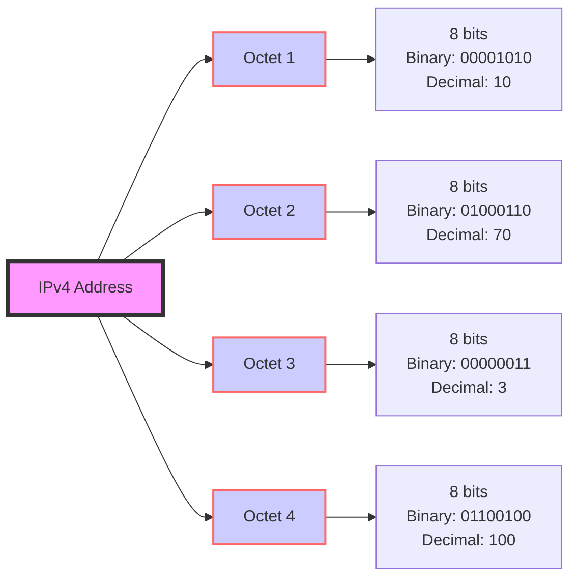

### 🗑️ Temp trash Can for my notes and snippets

 | Decimal Subnet Mask     | CIDR Notation |
|-------------------------|---------------|
| 255.255.255.255         | /32           |
| 255.255.255.254         | /31           |
| 255.255.255.252         | /30           |
| 255.255.255.248         | /29           |
| 255.255.255.240         | /28           |
| 255.255.255.224         | /27           |
| 255.255.255.192         | /26           |
| 255.255.255.128         | /25           |
| 255.255.255.0           | /24           |
| 255.255.254.0           | /23           |
| 255.255.252.0           | /22           |
| 255.255.248.0           | /21           |
| 255.255.240.0           | /20           |
| 255.255.224.0           | /19           |
| 255.255.192.0           | /18           |
| 255.255.128.0           | /17           |
| 255.255.0.0             | /16           |
| 255.254.0.0             | /15           |
| 255.252.0.0             | /14           |
| 255.248.0.0             | /13           |
| 255.240.0.0             | /12           |
| 255.224.0.0             | /11           |
| 255.192.0.0             | /10           |
| 255.128.0.0             | /9            |
| 255.0.0.0               | /8            |
| 254.0.0.0               | /7            |
| 252.0.0.0               | /6            |
| 248.0.0.0               | /5            |
| 240.0.0.0               | /4            |
| 224.0.0.0               | /3            |
| 192.0.0.0               | /2            |
| 128.0.0.0               | /1            |
| 0.0.0.0                 | /0 (Default)  |

### Why Minimize Broadcast Packets?

Minimizing broadcast packets helps maintain a smoother, faster, and more secure network. It's like keeping public announcements in a big building to only the floors that need to hear them, rather than blasting them everywhere! 

## Badly Formatted Mermaid Diagram

| Octet Position | Subnet Mask Example | Network Bits (1's) | Host Bits (0's) |
|----------------|---------------------|--------------------|-----------------|
| 1st Octet      | 255                 | 11111111           | 00000000        |
| 2nd Octet      | 255                 | 11111111           | 00000000        |
| 3rd Octet      | 192                 | 11000000           | 00111111        |
| 4th Octet      | 0                   | 00000000           | 11111111        |