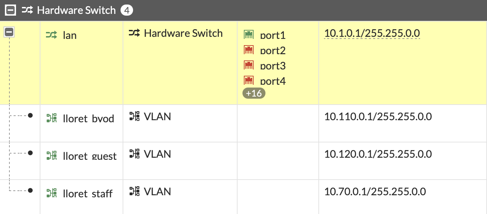

## Lloret Networks



```bash
set ip 10.1.0.1 255.255.0.0 #LAN
set ip 10.70.0.1 255.255.0.0 #STAFF
set ip 10.110.0.1 255.255.0.0 #BYOD
set ip 10.120.0.1 255.255.0.0 #GUEST
```

## Lloret LAN Block 

- [x] We have **10.1.0.1/16** as our LAN block.

??? "What is the mask in decimal?"

    | IP Address       | Subnet Mask       | CIDR Notation | Binary Subnet Mask         |
    |------------------|-------------------|---------------|----------------------------|
    | 10.1.0.1         | 255.255.0.0       | /16           | 11111111.11111111.00000000.00000000 |

??? "How many subnets?"

    - [x] No additional subnetting within the /16 range. It's a single subnet in Class A.

??? "How many hosts per subnet?"

    - [x] 16 bits left for Hosts = 2^16 - 2 = 65,534 hosts per subnet

??? "What subnet is host 10.1.0.130 in?"

    - [x] Since it's a single /16 subnet, 10.1.0.130 falls within 10.1.0.0/16.

??? "What is the broadcast address of 10.1.0.130/16 host?"

    - [x] For the 10.1.0.0/16 subnet, the broadcast address is 10.1.255.255.

??? "Example Specific Subnet Summary"

    | Concept                   | Explanation                                                  |
    |---------------------------|--------------------------------------------------------------|
    | Network Address           | 10.1.0.0 (10.1.0.130 falls in this range)                    |
    | CIDR Notation             | /16 (means 16 bits for network, remaining for host)          |
    | Subnet Mask               | 255.255.0.0 (or /16)                                         |
    | Binary Subnet Mask        | 11111111.11111111.00000000.00000000                          |
    | Host Address Range        | 10.1.0.0 - 10.1.255.255                                      |
    | Broadcast Address         | 10.1.255.255 (covers the entire 10.1.x.x range)              |

This example is specific to the 10.1.0.1/16 subnet, detailing its characteristics and addressing within a Class A network.

## Lloret Staff Block

- [x] We have **10.70.0.0/16** as our Staff block.

??? "What is the mask in decimal?"

    | IP Address       | Subnet Mask       | CIDR Notation | Binary Subnet Mask         |
    |------------------|-------------------|---------------|----------------------------|
    | 10.70.0.0        | 255.255.0.0       | /16           | 11111111.11111111.00000000.00000000 |

??? "How many subnets?"

    - [x] No additional subnetting within the /16 range. It's a single subnet in Class A.

??? "How many hosts per subnet?"

    - [x] 16 bits left for Hosts = 2^16 - 2 = 65,534 hosts per subnet

??? "What subnet is host 10.70.3.130 in?"

    - [x] Since it's a single /16 subnet, 10.70.3.130 falls within 10.70.0.0/16.

??? "What is the broadcast address of 10.70.3.130/16 host?"

    - [x] For the 10.70.0.0/16 subnet, the broadcast address is 10.70.255.255.

??? "Example Specific Subnet Summary"

    | Concept                   | Explanation                                                  |
    |---------------------------|--------------------------------------------------------------|
    | Network Address           | 10.70.0.0 (10.70.3.130 falls in this range)                  |
    | CIDR Notation             | /16 (means 16 bits for network, remaining for host)          |
    | Subnet Mask               | 255.255.0.0 (or /16)                                         |
    | Binary Subnet Mask        | 11111111.11111111.00000000.00000000                          |
    | Host Address Range        | 10.70.0.0 - 10.70.255.255                                    |
    | Broadcast Address         | 10.70.255.255 (covers the entire 10.70.x.x range)            |

---

