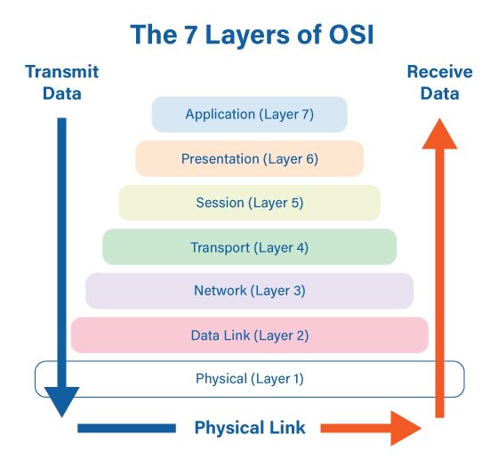

| Stage            | Description                                       |
|------------------|---------------------------------------------------|
| 1. Generation    | Data is generated or requested by an application. |
| 2. Encapsulation | Data is encapsulated into packets with headers.   |
| 3. Transmission  | Packets are transmitted over the network.         |
| 4. Routing       | Routers forward packets based on destination.    |
| 5. Switching     | Switches forward packets within local networks.   |
| 6. Arrival       | Packets arrive at their destination.              |
| 7. Decapsulation | Packets are decapsulated to retrieve data.       |
| 8. Delivery      | Data is delivered to the destination app.        |

# Packet Journey Through the OSI Model

{align=center}

```plaintext
  +-----------------------------------+
  | Layer 7: Application            |
  |   - Data generated by app       |
  +-----------------------------------+
  | Layer 6: Presentation           |
  |   - Data conversion and encoding|
  +-----------------------------------+
  | Layer 5: Session                |
  |   - Session management          |
  +-----------------------------------+
  | Layer 4: Transport              |
  |   - Segmentation/Reassembly     |
  |   - Ports and error checking    |
  +-----------------------------------+
  | Layer 3: Network                |
  |   - Routing                    |
  |   - Logical addressing          |
  +-----------------------------------+
  | Layer 2: Data Link              |
  |   - Frame creation/interpretation|
  |   - MAC addressing              |
  +-----------------------------------+
  | Layer 1: Physical               |
  |   - Transmission of raw bits    |
  +-----------------------------------+
```